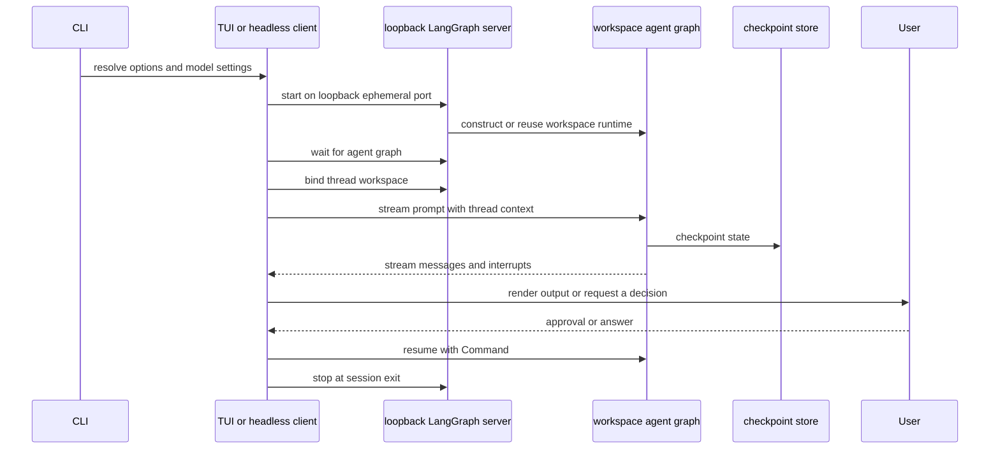

# Run and Resume a dcode Session

`dcode` has three operational modes with different process and persistence boundaries: the default Textual terminal UI, one-task headless mode (`-n`), and ACP over standard input/output (`--acp`). The TUI and headless runner are clients of a temporary loopback LangGraph server; ACP builds and hosts its own agent process. See also [code agent architecture](../architecture/code-agent.md), [configuration layering](../concepts/config-layering.md), [permissions and HITL](../concepts/permissions-hitl.md), [state persistence](../concepts/state-persistence.md), and [costs and sessions](../operations/cost-and-sessions.md).

## Choose the launch mode

```bash
# Interactive Textual UI
dcode

# A bounded task for automation
dcode -n "run the focused tests" --max-turns 8 --timeout 600

# Agent Client Protocol service over stdin/stdout
dcode --acp
```

Use the TUI when a person needs to review tools, answer `ask_user`, use `/threads`, or change session settings. `-n` starts a fresh thread and executes one task; it does not resume a TUI thread. `--max-turns` and `--timeout` are headless-only safeguards, and exhaustion of either exits with `124`. `-q` keeps agent output on stdout and operational output on stderr; `--no-stream` buffers the reply.

ACP is for an ACP-capable editor or client, not a shortcut to the TUI server. It uses its own model, MCP session manager, SQLite checkpointer, and per-session graph construction. Diagnose ACP dependency, model, or MCP loading failures independently from loopback-server startup.

> **Security boundary:** Treat the launch workspace as trusted input. Startup can resolve configuration, discover skills and MCP configuration, and inspect project files before an approval prompt appears. Tool approval governs model-requested actions, not every launch-time read. Use an explicitly selected remote sandbox when host-checkout isolation is required.

## Server-backed session lifecycle


```mermaid
sequenceDiagram
    participant CLI
    participant Client as TUI or headless client
    participant Server as loopback LangGraph server
    participant Graph as workspace agent graph
    participant Store as checkpoint store
    participant User
    CLI->>Client: resolve options and model settings
    Client->>Server: start on loopback ephemeral port
    Server->>Graph: construct or reuse workspace runtime
    Client->>Server: wait for agent graph
    Client->>Server: bind thread workspace
    Client->>Graph: stream prompt with thread context
    Graph->>Store: checkpoint state
    Graph-->>Client: stream messages and interrupts
    Client->>User: render output or request a decision
    User-->>Client: approval or answer
    Client->>Graph: resume with Command
    Client->>Server: stop at session exit
```

*The TUI and headless clients use a temporary local server, bind a workspace before execution, and stream against a checkpointed thread.*

`server_session` creates a temporary server configuration directory, starts `langgraph dev` on `127.0.0.1` with an ephemeral port, waits for the `agent` graph, and returns a `RemoteAgent` configured for the launch workspace. An explicit `--mcp-config` is validated before a subprocess is started. Failed startup, cancellation, and normal context-manager exit stop the process.

The server constructs the agent with the resolved model, tool and MCP set, sandbox, approval behavior, filesystem policy, extensions, and retry settings. Its runtime cache is not merely an optimization: graph execution and the server-owned offload route share the same workspace runtime so compaction uses the agent's actual backend and policy. Cache entries are keyed by workspace identity and runtime fingerprint; the cache is bounded.

## Workspace binding is the execution gate

A `RemoteAgent` carries a launch cwd and a server policy claim, but that is not sufficient authorization to run. For each thread, it calls the workspace route to create or verify a durable binding. The server validates the claim against its own policy, resolves the canonical workspace, persists the binding, builds the runtime before creating remote thread metadata, and returns the selected MCP metadata. A `validate_only` request can preflight compatibility without binding a thread or allocating a runtime.

At graph selection, a thread ID and matching workspace context are mandatory. The server rereads the bound workspace policy on execution:

- identity, trust, tool, sandbox, or approval-policy drift rejects the thread instead of silently changing its authority;
- changes confined to model, model parameters, prompts, and other runtime identity rebuild the runtime while retaining the binding and checkpoint history;
- a process-wide sandbox can be claimed by only one workspace, so a conflicting workspace is rejected; and
- diagnostics are deliberately limited to bounded, allowlisted policy values. They do not persist or report paths, credentials, environment values, model settings, prompts, or profile overrides.

A workspace conflict is normally a `409`; a runtime that cannot be built during workspace preflight is reported as unavailable rather than permitted to start a stream. Restore compatible policy or launch a separate server/workspace rather than attempting to override a persisted binding from the client.

## Execution, approvals, and retries

Interactive mode supports Manual, Auto, and YOLO approval. The client renders graph interrupts and resumes the same turn with `Command(resume=...)` after decisions or `ask_user` answers. YOLO requires its one-time acknowledgement. Project hooks and executable extensions are separate trust decisions; ordinary tool approval does not authorize loading them.

Headless mode has no approval UI. Shell execution is off unless a shell allow-list is configured; a restrictive list is enforced by middleware and `all` enables unrestricted shell execution. Other actions can be auto-approved for the one-task run, but permission hooks can still require their own decision path. The headless runner treats repeated unresolved HITL/allow-list work as a bounded failure, not an unattended prompt.

The retry middleware wraps only the model node, so a transient provider failure can be retried without replaying tool calls that already completed. It obtains the retry budget from the runtime-selected model for each request and re-raises an exhausted provider failure rather than turning it into an assistant response. `model_attempt` lifecycle events and correlated retry events tell the TUI and headless renderers whether partial output belonged to a superseded attempt, allowing them to mark or discard tentative state before replayed output arrives.

## Checkpoints, thread resume, and offload

SQLite checkpointing persists graph state and private resume facts such as the effective model. `dcode -r` asks the TUI to resolve the most-recent eligible thread; `dcode -r ID` requests a particular one. The app enforces the strictest configured resume-age cutoff, treats missing or invalid timestamps as unsafe, and offers a fresh session or exit when blocked. A missing thread, lookup failure, or database error falls back to a fresh thread. When a stored cwd differs from the launch cwd, the UI can offer a workspace switch; declining it at launch starts fresh.

`/offload` is a server-owned checkpoint operation, not a client-side transcript rewrite. The client ensures that the thread exists, supplies the server-validated workspace and runtime context, and loops through any hook interrupts. The server serializes operations per thread, refuses active, interrupted, pending, unbound, or changed threads, reads the checkpoint it will compact, and verifies that exact checkpoint is still current before committing. It may update only explicitly allowed offload state channels; it must not write `messages`. Consequently, a `409` means no offload state committed, while an indeterminate `500` must be surfaced because compaction may have occurred even if the final commit could not be confirmed.

Cancellation is cooperative but confirmed. If the client is cancelled while awaiting an offload step, it calls the per-operation cancel route and waits for the server task to reach `cancelled` or `finished`; it does not assume that cancelling a local await stopped the server. A handoff uses a dedicated route to summarize a source thread without compacting it, seeds a new bound thread with the summary, and switches only if new source activity would not be stranded.

## MCP and configuration operations

`--no-mcp` disables all MCP loading and cannot be combined with `--mcp-config`. An explicit MCP config is a direct request and is preflight-validated for server-backed launches. Discovery-based project servers remain subject to workspace trust and persisted approval policy. `dcode mcp login` follows the same distinction: explicit configuration is loaded directly, while discovered project servers must satisfy trust filtering.

The TUI may preload MCP metadata for display while the server starts, but the server owns the live tool instances. OAuth login produces credentials for a subsequent reconnect or server restart; it does not mutate tools already bound into a running graph.

## Diagnose failures and verify changes

From `libs/code`, bootstrap and run a local session:

```bash
make bootstrap
export DEEPAGENTS_CODE_DEBUG=1
uv run deepagents-code
```

Debug mode preserves the temporary server subprocess log and attaches a per-thread client log. Use the server log for graph construction, MCP, sandbox, and model initialization failures; use the client log for UI, remote-stream, and command behavior. Client log directories and files are hardened and symlink targets are refused; if secure file logging cannot be established, use the in-app Debug Console with `Ctrl+\\` (or hidden `/debug`), which also has an in-memory log tail without debug mode.

When changing this lifecycle, test the boundary that owns the invariant:

```bash
make test TEST_FILE=tests/unit_tests/test_main.py
make test TEST_FILE=tests/unit_tests/test_app.py
make test TEST_FILE=tests/unit_tests/test_offload_api.py
make test TEST_FILE=tests/unit_tests/test_remote_client.py
make test TEST_FILE=tests/unit_tests/test_model_retry.py
make check
```

These suites cover CLI launch dispatch and limits, TUI startup/resume and handoff behavior, workspace/offload HTTP status and commit guards, remote cancellation and hook-resume handling, and retry stream reconciliation. Pair changes to durable bindings or runtime policy with workspace and server-graph tests as well.
