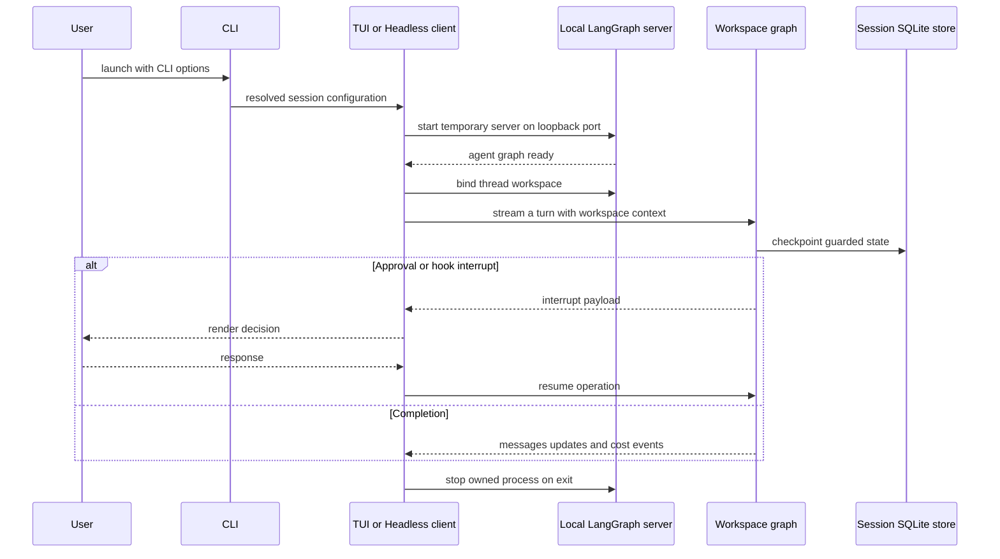
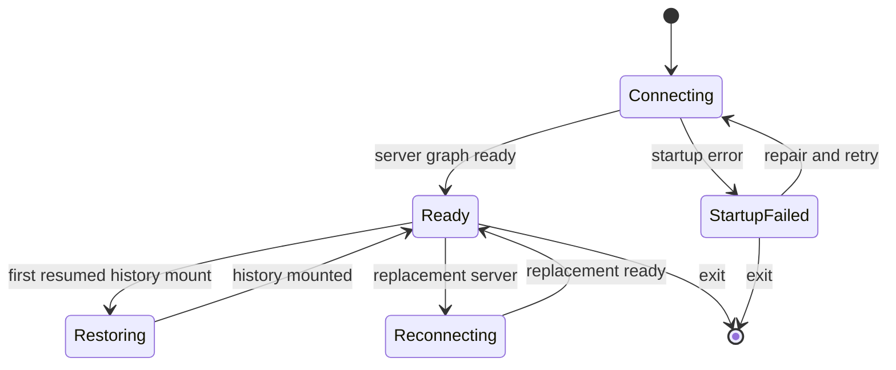

# Run a Deep Agents Code Session

`dcode` has three execution surfaces: the default Textual UI, one-task headless execution (`-n`), and an ACP server over standard input/output (`--acp`). Interactive and headless modes start a local LangGraph runtime and use `RemoteAgent` over HTTP/SSE; ACP is a separate stdio boundary. This page explains the operational lifecycle and the invariants to preserve when changing it. See [code agent architecture](../architecture/code-agent.md), [configuration layering](../concepts/config-layering.md), [context management](../concepts/context-management.md), [state persistence](../concepts/state-persistence.md), and [costs and sessions](../operations/cost-and-sessions.md).

## Choose the mode and bound automation

```bash
# Interactive Textual UI
dcode -M anthropic:claude-sonnet-4-5

# One bounded task for automation
dcode -n "run the focused tests" --max-turns 8 --timeout 600

# Agent Client Protocol service over stdin/stdout
dcode --acp
```

Use the TUI when a person must review actions, continue a durable conversation, or choose a thread. Use `-n` for a single autonomous task: the headless prompt tells the agent to investigate and make reasonable safe assumptions rather than wait for a follow-up. In headless mode, shell execution is disabled unless a shell allow-list enables it, while other tools are automatically approved. `-q` reserves stdout for response text; diagnostics and tool information go to stderr. `--no-stream` buffers the response. A turn-budget or wall-clock timeout exits with `124`; interruption exits with `130`.

`-M/--model` is provider-detected, `--model-params` is JSON that overrides configured model values, and `--max-retries N` overrides `[retries]` (`0` disables retries). `--summarization-model` can select a distinct compaction model. `--acp` selects the stdio ACP service rather than the Textual UI.

> **Treat project integration as code execution.** Explicit MCP configuration is validated before the subprocess is created. Headless runs require `--trust-project-hooks` to load project hook commands, and project MCP, extensions, and sandbox choices need deliberate trust and policy review.

## Startup, server selection, and workspace binding


```mermaid
sequenceDiagram
    participant User
    participant CLI
    participant Client as TUI or Headless client
    participant Server as Local LangGraph server
    participant Graph as Workspace graph
    participant Store as Session SQLite store
    User->>CLI: launch with CLI options
    CLI->>Client: resolved session configuration
    Client->>Server: start temporary server on loopback port
    Server-->>Client: agent graph ready
    Client->>Server: bind thread workspace
    Client->>Graph: stream a turn with workspace context
    Graph->>Store: checkpoint guarded state
    alt Approval or hook interrupt
        Graph-->>Client: interrupt payload
        Client-->>User: render decision
        User-->>Client: response
        Client->>Graph: resume operation
    else Completion
        Graph-->>Client: messages updates and cost events
    end
    Client->>Server: stop owned process on exit
```

*Interactive and headless clients launch an owned local server, bind a workspace per thread, then stream its graph through `RemoteAgent`.*

The launch manager captures a `ProjectContext`, preflights an explicit MCP file, derives `ServerConfig` from the CLI and configuration layers, exports its server environment, and scaffolds a temporary runtime containing `langgraph.json`, the checkpointer, and project metadata. It starts `langgraph dev` on loopback with port `0`, waits for the `agent` graph, creates `RemoteAgent`, and records an explicit workspace and its session-policy claim. Startup is transactional from the caller's perspective: if graph readiness, client construction, or workspace setup fails—or cancellation arrives before handoff—the manager stops the process in `finally`.

The server reads the same `ServerConfig` schema from environment. It builds tools, model, backend, middleware, and the graph under an immutable workspace environment snapshot, rather than applying a workspace `.env` globally. The default runtime is cached for the process. For an actual streamed execution, `make_graph` requires both a thread ID and workspace context, verifies the durable binding, then returns the graph runtime selected for that binding.

A workspace binding is not merely a client-side cwd. `RemoteAgent` caches the server-validated descriptor by thread ID and sends it with runs, model calls, side questions, and offload operations. A missing configured workspace is an error. A workspace switch changes client state only after the server accepts the destination binding; a failed request retains the previous cwd and cached bindings. On the server, access-policy or project-policy drift refuses execution rather than silently changing the permissions of a resumed conversation. A changed runtime identity such as model parameters can rebuild the runtime while retaining the durable binding and checkpoints. Process-wide sandboxes and incompatible tracing settings may prevent a second workspace from sharing the server.

The graph factory caches a `ServerRuntime` containing the compiled agent, composite backend, server-owned offload operation, and startup metadata. Agent construction selects either a local shell/filesystem backend or sandbox backend, wires memory, skills, context, cost, retry, compaction, hooks, and tool middleware, and attaches an offload operation to the same backend. An explicit filesystem allow-list must be installed into synchronous subagents as well as the main graph; otherwise delegation through `task` would bypass it.

## Tool approvals and streamed turns

By default interactive tool calls that can change state are interrupted for human review. `create_cli_agent` only installs the approval middleware when neither global auto-approval nor headless restrictive-shell mode suppresses it. Auto mode replaces ordinary approval middleware with classifier-backed review when eligible; it is disabled for sandbox-backed graphs. A restrictive shell allow-list validates shell commands inline so headless execution does not need an approval/resume loop.

`RemoteAgent.astream` delegates SSE mechanics and stream-mode negotiation to LangGraph `RemoteGraph`, converts message dictionaries to LangChain message objects for the UI, converts interrupt updates, and passes workspace context plus local ownership headers. State snapshots stay server-shaped, and session costs arrive separately as custom stream events or checkpoint state. This distinction matters when changing the adapter: do not make a rendering failure rewrite server state.

Model retry is deliberately placed around the model node inside side-effecting compaction. A transient model failure therefore retries the final model handler without replaying completed tools, summaries, or archive writes. Retry middleware classifies transient failures, applies backoff, and emits attempt/retry events so clients can mark partial output and reconcile a replay.

## TUI readiness and ordered recovery


```mermaid
stateDiagram-v2
    [*] --> Connecting
    Connecting --> Ready: server graph ready
    Connecting --> StartupFailed: startup error
    Ready --> Restoring: first resumed history mount
    Restoring --> Ready: history mounted
    Ready --> Reconnecting: replacement server
    Reconnecting --> Ready: replacement ready
    StartupFailed --> Connecting: repair and retry
    Ready --> [*]: exit
    StartupFailed --> [*]: exit
```

*The TUI treats first-time history restoration differently from later reconnections and settles startup failures explicitly.*

The background worker records the server process before posting `ServerReady`, so outer teardown can stop it even if the UI quits before delivery. On `ServerReady`, the app first latches `_resuming` into `_restoring_resumed_history`, then clears connection/reconnect flags, installs the agent and process, refreshes MCP and model presentation, schedules one session-start task, and conditionally drains deferred actions. The order is significant: clearing connection state causes normal status synchronization to drop `_resuming`, while the latch keeps the status visible during history restoration.

The session-start task serializes: resumed-history hydration, optional `--startup-cmd`, initial prompt or skill, then user-queued messages. It is idempotent for history loading, so a reconnect can drain queued input and recovery work but cannot mount a populated transcript again. Keep new startup actions inside this sequence rather than independently draining chat input.

A startup failure clears connecting, reconnecting, resume, and restoration flags and keeps a formatted failure for recovery UI such as `/model` or `/auth`. After terminal startup failure, `/install`, `/reload`, and `/update` may bypass the queue only when no agent, shell, or modal command is active. This permits repair without allowing installation changes during an active turn.

## Offload, handoff, and cancellation

Context compaction is a server-owned operation because it reads and mutates checkpointed history through the same backend and hooks as the graph. `RemoteAgent.aoffload` ensures the HTTP-side thread record exists first—checkpoint persistence can survive a server restart even when the live LangGraph thread row does not—then posts an operation ID, ownership data, workspace context, and any hook responses. The server may return an interrupt; the client fulfills that hook and resubmits the same operation ID, with a bounded number of rounds. The client validates typed completion fields before the UI renders the result.

Cancellation is also a protocol, not just cancelling the local await. If an offload task is cancelled, the client POSTs the operation-specific cancel route and defers repeated local cancellation until the server acknowledges `cancelled` or `finished`. This prevents Esc from returning while the server may still mutate the thread. Ordinary recovery writes handle a server-side `409` by cancelling active pending/running runs concurrently with bounded per-run waits and retrying the state update once.

A cache-expiry handoff summarizes the source without compacting it, archives the transcript, seeds a child thread, reserves it before switching, and releases that child reservation if the switch does not complete. Consequently, the original durable thread remains resumable with its full context. Near cache expiry, the TUI warns once per retention window; the `warnings.cache_prompt = "expiry"` policy offers handoff only while the app is truly idle. When an interactive message arrives, the user can hand off, send, or cancel, and the draft is retained for handoff or cancellation.

## Durable threads and safe resume

Threads are checkpoint-backed records in the sessions SQLite store. Listing uses a covering checkpoint index before optionally enriching message counts and initial prompts. Durable names live independently in `dcode_thread_names`, with a latest-root-checkpoint metadata fallback for older stores. A name is trimmed, printable, single-line text of 1–50 characters; saved names take precedence in listings and completion labels.

The generated local-server checkpointer is ownership-fenced. A client lease has an OS-lock-backed owner token, and every checkpoint mutation checks both the supplied token and live reservation. This protects against stale server writes after client exit, release, or successor takeover; an in-flight writer guard prevents a race with takeover.

`/threads` can render cached rows and then reload its selected sort and cwd scope from disk. It checks ownership before dismissing its modal: an occupied selection retains filter and highlighted row and does not load history or replace the active thread. For bare `-r`, dcode tries candidates in recency order and skips occupied threads; for an explicit occupied ID it fails rather than substituting a different conversation. A `@@query` reference searches durable name, ID, prompt, agent, branch, and cwd, displays the preferred saved name, but inserts an ID-only `@@(thread:...)` token so a rename cannot break the reference.

For offline inspection, use the built-in `deepagents-thread-inspector` skill rather than decoding checkpoint blobs manually:

```bash
python3 "$SKILL_DIR/scripts/inspect_sessions.py" THREAD_ID --mode latest-turn
python3 "$SKILL_DIR/scripts/inspect_sessions.py" THREAD_ID --mode summary
python3 "$SKILL_DIR/scripts/inspect_sessions.py" --list 20
```

The inspection path is read-only and intended only for trusted local state. Summarize output, report reconstruction warnings and truncation, and do not expose unrelated secrets, personal data, or hidden reasoning.

## Command queue changes

`COMMANDS` is the single declaration point for static slash commands. The registry derives queue-bypass sets, including aliases, and autocomplete entries from it; experimental commands are omitted unless experimental mode is enabled. `/skill:<name>` is dynamic and discovered separately. After editing catalog metadata, regenerate `COMMANDS.md` with `make commands-catalog` rather than editing it directly.

| Tier | Meaning |
| --- | --- |
| `ALWAYS` | Executes regardless of busy state; reserve for quit, restart, and recovery behavior. |
| `CONNECTING` | Executes only during initial connection when no work is active. |
| `IMMEDIATE_UI` | Opens UI immediately and defers its actual work. |
| `SIDE_EFFECT_FREE` | Performs a safe immediate action while delaying chat output if necessary. |
| `QUEUED` | Waits for idle; default for graph and session mutations. |

## Focused validation

Run tests from `libs/code`, beginning with the boundary changed:

```bash
make commands-catalog
make test TEST_FILE=tests/unit_tests/test_app.py
make test TEST_FILE=tests/unit_tests/test_remote_client.py
make test TEST_FILE=tests/unit_tests/test_sessions.py
make test TEST_FILE=tests/unit_tests/test_server_manager.py
make test TEST_FILE=tests/unit_tests/test_server_graph.py
make test TEST_FILE=tests/unit_tests/test_thread_ownership.py
make test TEST_FILE=tests/unit_tests/test_command_registry.py
make test TEST_FILE=tests/unit_tests/test_model_retry.py
make check
```

For startup work, exercise the real `ServerReady` handler under `run_test()` and assert that the resume latch precedes connection clearing, first history loading is idempotent, and a reconnect drains queued work without rehydrating history. For workspace work, assert per-thread caching, explicit policy/fingerprint pairing, rejected switches preserving prior client state, and server-side refusal for workspace or policy drift. For offload work, test registration before the first request, hook round trips, cancellation acknowledgement, result validation, and the distinction between no-commit conflicts and indeterminate server failure. For resume and ownership work, test occupied most-recent skipping versus explicit rejection, durable name precedence, and stale-token fencing.
