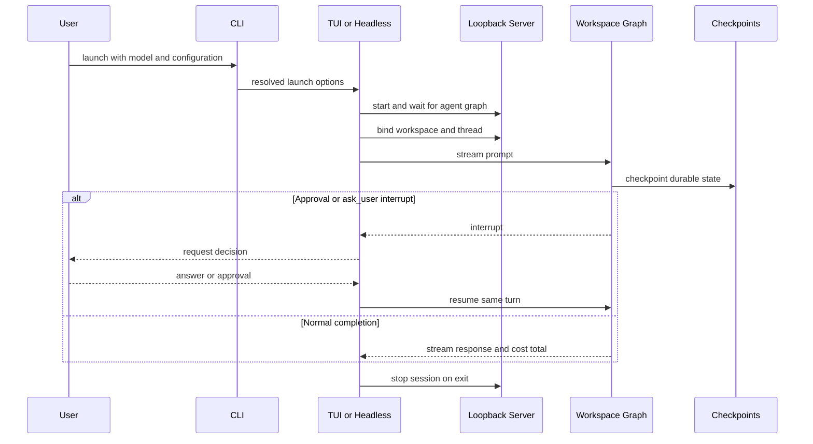

# Run and Change a dcode Session

`dcode` has three deliberately separate operating boundaries: the default Textual terminal UI, one-task headless execution (`-n`), and ACP on standard input/output (`--acp`). Interactive and headless are clients of a temporary loopback LangGraph server. ACP is not: it constructs its own model, MCP tools, SQLite checkpointer, and ACP context. This distinction is the first debugging decision—presentation and input failures normally belong to the client, while graph startup, models, tools, checkpointing, and policy belong to the server. See [code agent architecture](../architecture/code-agent.md), [SDK construction and execution](../architecture/sdk-construction-execution.md), [MCP](../integrations/mcp.md), and [costs and sessions](../operations/cost-and-sessions.md).

## Choose a mode and bound the run

```bash
# Interactive Textual UI
dcode -M anthropic:claude-sonnet-4-5

# One bounded task for automation
dcode -n "run the focused tests" --max-turns 8 --timeout 600

# Agent Client Protocol service over stdin/stdout
dcode --acp
```

Use the TUI for approvals, `ask_user`, `/threads`, `/effort`, and a durable conversation. `-n` creates a new thread for one task rather than resuming a TUI thread. Its turn or timeout budget exits with status `124`; `-q` keeps agent output on stdout and operational output on stderr, while `--no-stream` buffers the reply. ACP is for an ACP-capable editor or client, not a shortcut to the temporary TUI server; diagnose its model and MCP initialization independently.

`-M/--model` selects a model with provider auto-detection. `--model-params` must be a JSON object and overrides configured provider values. dcode owns the model-node retry budget through `--max-retries` or configuration, so provider-native retry parameters in CLI model parameters are disabled rather than allowed to multiply attempts. Reasoning effort is a property of the effective model profile, not a universal switch: `/effort` offers only profile-advertised levels, with a narrower low/medium/high set for Anthropic `between_tools` thinking.

> **Startup is a trust boundary.** Launch can resolve configuration and discover project files, skills, hooks, and MCP configuration before a tool-approval prompt. Tool approval governs model-requested actions, not every startup read. Project-discovered MCP servers need applicable trust and persisted approval policy; an explicit MCP configuration is loaded directly. `dcode mcp login` follows the same distinction.

## Trace the server-backed turn


```mermaid
sequenceDiagram
    participant User
    participant CLI
    participant Client as TUI or Headless
    participant Server as Loopback Server
    participant Graph as Workspace Graph
    participant Store as Checkpoints
    User->>CLI: launch with model and configuration
    CLI->>Client: resolved launch options
    Client->>Server: start and wait for agent graph
    Client->>Server: bind workspace and thread
    Client->>Graph: stream prompt
    Graph->>Store: checkpoint durable state
    alt Approval or ask_user interrupt
        Graph-->>Client: interrupt
        Client-->>User: request decision
        User-->>Client: answer or approval
        Client->>Graph: resume same turn
    else Normal completion
        Graph-->>Client: stream response and cost total
    end
    Client->>Server: stop session on exit
```

*Interactive and headless turns share the temporary-server, binding, streaming, checkpointing, and cleanup lifecycle.*

Interactive and headless launch start `langgraph dev` on loopback with a temporary configuration directory and ephemeral port, wait for the `agent` graph, then bind a `RemoteAgent` to the launch workspace. Failed startup, cancellation, and normal session exit tear the subprocess down. Interactive startup resolves a displayable model identity before provider construction and can defer server startup when credentials are absent; the resolved model, policy, sandbox, and MCP options are passed into the server-backed TUI session.

A workspace claim from the client is not authorization by itself. Before graph execution the server creates or verifies a durable per-thread workspace binding and validates policy itself. Policy drift is rejected. Runtime-only identity changes rebuild the runtime without discarding checkpoint history. Refusal diagnostics are deliberately bounded and allowlisted: they exclude paths, credentials, environment values, model details, prompts, and profile overrides.

`create_cli_agent` is the graph-construction extension boundary for backends, filesystem and shell exposure, skills, memory, `ask_user`, subagents, MCP tools, approval middleware, persistence, and generated system context. In Manual interactive operation, interrupts render in the TUI and the client resumes the same turn. Headless has no approval UI: shell access is gated through the allow-list, and its budget prevents an unattended run from waiting indefinitely.

Model retry wraps the model node rather than the whole graph. Transient model failures can therefore retry without replaying completed tool calls, use per-request retry settings, and re-raise a terminal provider failure rather than turn it into an AI response. Correlated retry and model-attempt events let TUI and headless renderers distinguish tentative partial output from a replayed response.

MCP middleware normalizes empty optional string arguments. A timeout becomes a warning that retrying may duplicate still-running server-side work; detected expired authentication becomes an actionable tool error. `--no-mcp` and `--mcp-config` are mutually exclusive.

## Keep and change durable session state safely

The graph owns durable session cost. It checkpoints cumulative cost and emits an absolute `session_cost` event, allowing clients to converge on the total without independent lifetime accounting. The TUI can add provisional spend until the next server total arrives, so display remains responsive while nested work is in flight.

Set `[warnings].session_cost_threshold_usd` to a positive dollar amount to show an interactive soft-limit warning once when an estimated thread total exceeds it; `0` disables it. The modal remains on screen until Enter or Escape acknowledges it and recommends `/offload` to reduce context use or `/clear` to start a thread. A cost already above the threshold on thread restore is treated as already warned, while a later crossing in a thread below the threshold can warn. Acknowledging the modal does not cancel a running agent.

`dcode -r` asks the TUI for the most recent eligible thread, and `dcode -r ID` requests a named one. Resume applies the configured age policy and falls back to a fresh session for missing threads or database errors; it can offer to switch to the stored working directory. `/offload` is server-owned checkpoint work: it serializes a thread, rejects active, interrupted, pending, unbound, or changed checkpoints, and permits commits only to allowlisted state channels rather than `messages`. Cancellation while awaiting offload asks the server to cancel and waits for a terminal operation state. A handoff summarizes a source without compacting it and can seed a newly bound thread.

## Read subagent fan-out in the TUI

A `task()` dispatched inside a `js_eval` call is not visible in the normal message stream. The QuickJS bridge instead emits custom `subagent` lifecycle events. The Textual adapter accepts only main-agent `subagent` events and forwards them to the mounted `SubagentPanel`; this makes the panel an interaction contract between stream producer, adapter, and UI rather than a transcript renderer.

The panel is hidden until a start event, groups records by the parent `js_eval` call (`eval_id`), and follows the active phase unless the user selects an older one. It represents running, done, error, and cancelled records; interrupted turns explicitly finalize still-running rows as cancelled because a cancellation may not produce a terminal bridge event. Starting the next turn clears phase data, but a user's expanded/collapsed preference survives. Replay events preserve elapsed timing rather than reset it.

Treat all event text as untrusted. Labels, descriptions, types, and errors originate from LLM-authored JavaScript, so the panel strips control, escape, and bidi characters, bounds text, and renders plain Textual content. When changing event shape or rendering, preserve that sanitization and test a malicious label as well as normal start/complete/error flows.

## Change prompt or UI contracts deliberately

`system_prompt.md` is packaged model-visible instruction text, not developer-only documentation. It directs the agent's work style, task lifecycle, tool usage, safety, and exactness expectations. The composed prompt also contains middleware-injected local context, memory, and skills.

`tests/unit_tests/smoke_tests/test_system_prompt.py` snapshots the *full first system message* sent to a fake model for both interactive and headless local runs. It fixes cwd, model identity, local-context output, and generated backend roots, then redacts machine-specific paths so the golden files are reproducible. It separately asserts that interaction and memory guidance differ correctly: headless must not receive unreachable instructions to ask the user and instead reports blockers and completed work.

Do **not** update those snapshots merely to make a test pass. A snapshot diff changes what the model sees. State in review which prompt behavior changed, why interactive and headless behavior should change (or remain equivalent), and whether memory, local context, or skill guidance changed. Use `--update-snapshots` only after that explanation and inspect the complete diff.

Textual tests are likewise interaction contracts. Prefer `run_test()`/pilot flows that mount the real widget and assert rendered content and observable state. For modals, exercise keyboard dismissal on the actual app path; direct action-method tests can miss focus or modal-stack behavior. For a subagent-panel change, cover phase selection, collapse persistence, turn reset, cancellation finalization, replay timing, narrow rendering, and sanitization as applicable—not just private helper output.

## Diagnose and run focused checks

From `libs/code`, debug mode preserves the server log and attaches a per-thread client log:

```bash
make bootstrap
export DEEPAGENTS_CODE_DEBUG=1
uv run deepagents-code
```

Use the server log for graph construction, MCP, sandbox, and model initialization failures, and the client log for UI and remote-stream behavior. If secure file logging cannot be used, the in-app Debug Console remains available.

Run the owner tests first, then broader checks:

```bash
make test TEST_FILE=tests/unit_tests/test_main.py
make test TEST_FILE=tests/unit_tests/test_app.py
make test TEST_FILE=tests/unit_tests/test_agent.py
make test TEST_FILE=tests/unit_tests/test_offload_api.py
make test TEST_FILE=tests/unit_tests/test_remote_client.py
make test TEST_FILE=tests/unit_tests/test_model_retry.py
make test TEST_FILE=tests/unit_tests/smoke_tests/test_system_prompt.py
make test TEST_FILE=tests/unit_tests/tui/widgets/test_subagent_panel.py
make test TEST_FILE=tests/unit_tests/tui/modals/test_session_cost.py
make check
```

These checks cover CLI dispatch and limits, startup/resume, workspace and offload guards, cancellation, retry streaming, prompt composition, cost warning behavior, and the subagent fan-out UI. Add a focused test at the producer/consumer boundary whenever changing a stream event, checkpoint channel, prompt fragment, or modal lifecycle.
