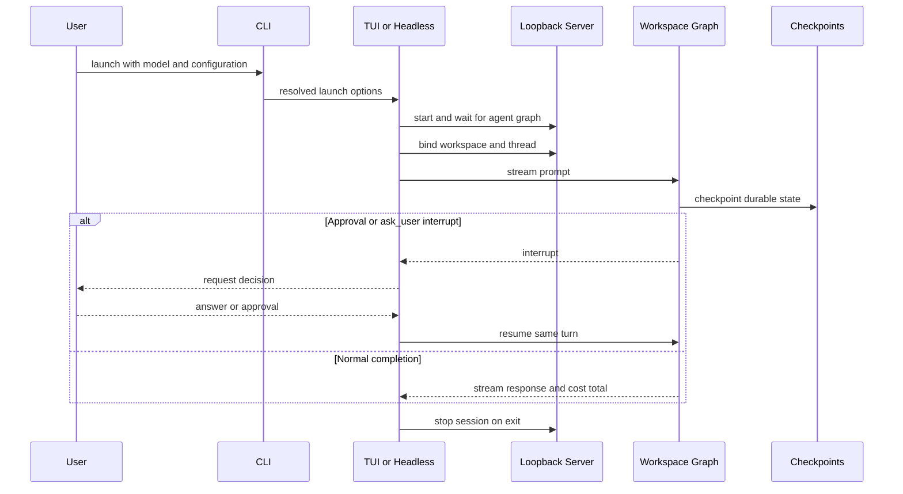

# Run and Change a dcode Session

`dcode` has three separate operating boundaries: the default Textual terminal UI, one-task headless execution (`-n`), and ACP over standard input/output (`--acp`). Interactive and headless are clients of a temporary loopback LangGraph server; ACP constructs its own model, MCP tools, SQLite checkpointer, and ACP context. Diagnose graph startup, models, tools, checkpointing, and policy on the server side; diagnose typing, queueing, modals, and rendering in the client. See [code agent architecture](../architecture/code-agent.md), [configuration layering](../concepts/config-layering.md), [MCP](../integrations/mcp.md), [costs and sessions](../operations/cost-and-sessions.md), and the [testing guide](../testing/testing-guide.md).

## Choose a mode and bound the run

```bash
# Interactive Textual UI
dcode -M anthropic:claude-sonnet-4-5

# One bounded task for automation
dcode -n "run the focused tests" --max-turns 8 --timeout 600

# Agent Client Protocol service over stdin/stdout
dcode --acp
```

Use the TUI for approvals, `ask_user`, `/threads`, `/effort`, and a durable conversation. `-n` creates a new thread for one task rather than resuming a TUI thread. Its turn or timeout budget exits with status `124`; `-q` keeps agent output on stdout and operational output on stderr, while `--no-stream` buffers the reply. ACP is for an ACP-capable editor or client, not a shortcut to the temporary TUI server.

`-M/--model` selects a model with provider auto-detection. `--model-params` must be a JSON object and overrides configured provider values. dcode owns the model-node retry budget through `--max-retries` or configuration, so provider-native retry parameters are disabled rather than allowed to multiply attempts. Reasoning effort is determined by the effective model profile; `/effort` exposes only supported levels, with Anthropic `between_tools` limited to low, medium, and high.

> **Startup is a trust boundary.** Launch can resolve configuration and discover project files, skills, hooks, and MCP configuration before a tool-approval prompt. Explicit MCP configuration loads directly, while project-discovered MCP servers require applicable trust and persisted approval policy. `dcode mcp login` follows the same discovery and trust distinction.

## Trace a server-backed session


```mermaid
sequenceDiagram
    participant User
    participant CLI
    participant Client as TUI or Headless
    participant Server as Loopback Server
    participant Graph as Workspace Graph
    participant Store as Checkpoints
    User->>CLI: launch with model and configuration
    CLI->>Client: resolved launch options
    Client->>Server: start and wait for agent graph
    Client->>Server: bind workspace and thread
    Client->>Graph: stream prompt
    Graph->>Store: checkpoint durable state
    alt Approval or ask_user interrupt
        Graph-->>Client: interrupt
        Client-->>User: request decision
        User-->>Client: answer or approval
        Client->>Graph: resume same turn
    else Normal completion
        Graph-->>Client: stream response and cost total
    end
    Client->>Server: stop session on exit
```

*Interactive and headless turns share the temporary-server, binding, streaming, checkpointing, and cleanup lifecycle.*

Interactive and headless launch a loopback server with a temporary configuration directory and ephemeral port, wait for the `agent` graph, and bind a `RemoteAgent` to the workspace. Failed startup, cancellation, and normal exit tear down the subprocess. Interactive startup resolves a displayable model identity before provider construction and can defer server startup when credentials are absent.

A workspace claim is not authorization by itself. The server durably creates or verifies a per-thread binding before graph execution, rejects policy drift, and rebuilds the runtime for runtime-only identity changes without discarding checkpoint history. Refusal diagnostics contain only a bounded allowlisted policy snapshot, excluding paths, credentials, environment values, model details, prompts, and profile overrides.

`create_cli_agent` is the graph-construction extension boundary for backends, filesystem and shell exposure, skills, memory, `ask_user`, subagents, MCP tools, approval middleware, persistence, and generated system context. Model retry wraps the model node—not the whole graph—so transient failures do not replay completed tool calls. Correlated retry/model-attempt events let TUI and headless output distinguish tentative partial text from a replayed response. MCP middleware normalizes empty optional strings, warns that retrying a timeout can duplicate server work, and reports expired authentication as an actionable tool error.

## Preserve server-ready and resume lifecycle

The TUI queues input while `_connecting` is true. A successful `ServerReady` event is the transition that installs the remote agent and server process, settles connection state, refreshes MCP and model UI state, starts the serialized post-connect sequence, and then drains deferred actions. The initial sequence hydrates resumed history, runs `--startup-cmd`, then dispatches an initial prompt or skill and queued user messages in that order.

Resume progress has two distinct phases. `_resuming` is armed only for the initial `-r` connection. At `ServerReady`, the app must latch it into `_restoring_resumed_history` **before** clearing `_connecting`, because status synchronization consumes `_resuming`. The status bar therefore continues to say “Resuming” while transcript restoration runs. Clear the restoring flag through its repainting helper on restoration completion or start failure. Do not re-arm it on `/restart` or MCP reconnect: later `ServerReady` events must not rehydrate an already populated transcript or resurrect a stale resume indicator.

A failed server startup is terminal for that session and records a formatted error plus structured missing-credential/provider-package context. This makes recovery commands meaningful rather than merely informational: `/model` and `/auth` can open their UI immediately, while the allowlisted repair commands `/install`, `/reload`, and `/update` may escape the otherwise parked queue only after startup failed and only when no agent, shell, or modal command is running.

## Change slash commands from the registry

`command_registry.COMMANDS` is the single declaration point for a static slash command’s canonical name, description, aliases, autocomplete metadata, experimental visibility, and queue classification. Do not add a hard-coded command list to the input widget or queue handler. The registry projects command entries for autocomplete and derives the command-name sets used by each bypass tier, including aliases.

| Tier | Busy-state behavior | Change rule |
| --- | --- | --- |
| `ALWAYS` | Runs even during agent work or thread switching. | Reserve for recovery/exit behavior such as `/restart`, `/force-clear`, and `/quit`. |
| `CONNECTING` | Runs only during initial connection when no work is active. | Use for connection-safe information such as `/version`. |
| `IMMEDIATE_UI` | Opens a modal now; deferred callback performs real work. | Only bare commands bypass. Add an exact entry to `IMMEDIATE_UI_ARG_FORMS` only for an argument form that merely opens UI. |
| `SIDE_EFFECT_FREE` | Performs its side effect now; chat output waits for idle. | Do not use for state-changing operations that race a turn. |
| `QUEUED` | Waits for idle. | This is the default for graph/session mutation. Startup recovery is a narrow additional exemption, not a new tier. |

`_can_bypass_queue` canonicalizes command input and applies the registry-derived classes. Consequently, `/auto model` may open its picker while `/auto model <spec>` and `/auto model clear` remain queue-bound; the latter mutate classifier state. Keep aliases in the registered command so the derived tier set, autocomplete, and Enter-key recovery path agree. Dynamic `/skill:<name>` entries are discovered separately and must not be confused with static registry aliases.

## Inspect costs without interrupting a turn

Session cost is graph-owned and checkpointed. The graph emits an absolute cumulative `session_cost` event, so clients converge on the server total rather than retaining an independent lifetime ledger. The TUI may display provisional spend until that total arrives.

The footer’s rendered cost span is clickable. A left single click stops event propagation and dispatches `app.open_cost_breakdown`; other clicks do not open it. This matters because an unhandled click could also invoke the app’s input-refocus behavior. The action obtains a live formatted breakdown from the app: if historical detail is unavailable it shows a notification rather than an empty modal; if a `CostBreakdownScreen` is already on the screen stack it does not stack another one.

The modal is intentionally live and safe to copy: it refreshes from its provider every 0.5 seconds, sanitizes control characters while retaining line breaks, renders plain content, supports `c` to copy its current complete text, and closes with Escape. Preserve those properties when changing formatting or the cost data contract.

Set `[warnings].session_cost_threshold_usd` to a positive amount to show an acknowledgement-only warning on the first strictly over-threshold total for a thread; `0` disables it. A restored above-threshold thread is already warned. The acknowledgement neither cancels the agent nor changes cost accounting.

## Keep and recover durable threads

`dcode -r` selects the most recent eligible thread, and `dcode -r ID` requests a named thread. Resume observes the configured age policy, falls back to a new session for missing threads or database errors, and can offer a switch to the stored working directory.

`/offload` is server-owned checkpoint work. It serializes a thread; rejects active, interrupted, pending, unbound, or changed checkpoints; and commits only allowlisted state channels rather than `messages`. Cancellation requests server-side cancellation and waits for a terminal operation status. A handoff summarizes a source without compacting it and can seed a new bound thread.

## Change UI and prompt contracts deliberately

Subagent lifecycle events from model-authored JavaScript are validated by the adapter and rendered in `SubagentPanel` by `js_eval` phase. The panel preserves user expansion and phase selection across events, while an interrupted turn finalizes unfinished rows as cancelled. Sanitize and bound all model-authored labels, descriptions, types, and errors before plain Textual rendering; they must not introduce controls, terminal escapes, bidi text, or markup.

`system_prompt.md` is model-visible instruction text. Its smoke test captures the complete first system message for reproducible interactive and headless runs, normalizes machine-specific values, and asserts that headless does not receive unreachable user-question guidance. Treat a snapshot change as a behavioral change: explain it, review the full diff, and use `--update-snapshots` only deliberately.

## Run focused checks

From `libs/code`, debug mode preserves the server log and attaches a per-thread client log:

```bash
make bootstrap
export DEEPAGENTS_CODE_DEBUG=1
uv run deepagents-code
```

Use server logs for graph construction, MCP, sandbox, and model initialization; use client logs for UI and remote-stream behavior. The in-app Debug Console remains available when secure file logging cannot be used.

For this workflow, test the observable boundary you changed before broad checks:

```bash
make test TEST_FILE=tests/unit_tests/test_app.py
make test TEST_FILE=tests/unit_tests/test_command_registry.py
make test TEST_FILE=tests/unit_tests/tui/widgets/test_chat_input.py
make test TEST_FILE=tests/unit_tests/tui/widgets/test_status.py
make test TEST_FILE=tests/unit_tests/tui/modals/test_cost_breakdown.py
make test TEST_FILE=tests/unit_tests/test_main.py
make test TEST_FILE=tests/unit_tests/test_offload_api.py
make test TEST_FILE=tests/unit_tests/test_remote_client.py
make test TEST_FILE=tests/unit_tests/test_model_retry.py
make test TEST_FILE=tests/unit_tests/smoke_tests/test_system_prompt.py
make check
```

For a server-ready change, drive the real event handler and assert the resume latch ordering, failure clearing, and reconnect non-rearm behavior. For queue changes, test both the registry invariant and the full Enter/submission route: recovery commands must pass while paused, ordinary input must remain editable and unsent. For a footer/modal change, use `run_test()` to click the rendered dollar span, verify duplicate-modal suppression, live refresh, Escape focus restoration, and the no-detail notification. For status-bar picker or model-label changes, assert painted hit-target metadata and non-bubbling clicks, including narrow layouts and Ctrl-click copy behavior.
