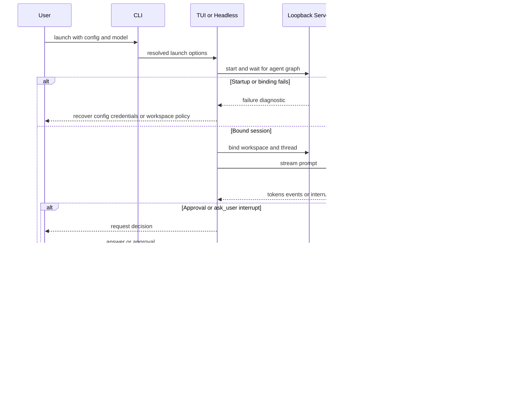

# Run and Resume a dcode Session

`dcode` has three deliberately different operating boundaries: the default Textual terminal UI, one-task headless execution (`-n`), and ACP on standard input/output (`--acp`). The first two are clients of a temporary loopback LangGraph server; ACP constructs its own agent context, MCP tools, and SQLite checkpointer. See [code agent architecture](../architecture/code-agent.md), [configuration layering](../concepts/config-layering.md), [profiles and models](../concepts/profiles-models.md), [MCP](../integrations/mcp.md), and [costs and sessions](../operations/cost-and-sessions.md).

## Select the mode, model, and limits

```bash
# Interactive Textual UI
dcode -M anthropic:claude-sonnet-4-5

# One bounded task for automation
dcode -n "run the focused tests" --max-turns 8 --timeout 600

# Agent Client Protocol service over stdin/stdout
dcode --acp
```

Use the TUI for approvals, `ask_user`, `/threads`, `/effort`, and a durable conversation. `-n` creates a new thread for one task rather than resuming a TUI thread. Its turn or timeout budget exits with status `124`; `-q` keeps agent output on stdout and operational output on stderr, while `--no-stream` buffers the reply. ACP is for an ACP-capable editor/client, not a shortcut to the temporary TUI server, so diagnose its dependencies, model, and MCP initialization separately.

`-M/--model` selects a model with provider auto-detection. `--model-params` must be a JSON object and takes precedence over configured provider values; `--profile-override` is likewise JSON and layers over configured profile overrides. `--max-retries` controls the dcode model-node retry budget: provider-native retry parameters passed in `--model-params` are intentionally disabled and reported as ignored, preventing nested retries from multiplying attempts. Model construction enforces `models.allowed` before credential bridging or provider initialization, then applies profile, configuration, and CLI parameters in precedence order.

Effort is a property of the effective model profile, not a universal CLI switch. `/effort` only offers profile-advertised reasoning levels; it additionally filters Anthropic's available levels when the effective thinking mode is `between_tools`. Native provider forms and the canonical `reasoning_effort` in model parameters are recognized so an explicit launch or `/model` parameter wins over restored session effort.

> **Launch trust boundary:** Starting in a checkout can resolve configuration and discover project files, skills, hooks, and MCP configuration before a tool-approval prompt. Tool approval governs model-requested actions, not every startup read. A project `.env` cannot replace protected interpreter, loader, shell, Git, path, or profile/trust-root variables.

## Server-backed session and recovery boundaries


```mermaid
sequenceDiagram
    participant User
    participant CLI
    participant Client as TUI or Headless
    participant Server as Loopback Server
    participant Graph as Workspace Graph
    participant Store as Checkpoints
    User->>CLI: launch with config and model
    CLI->>Client: resolved launch options
    Client->>Server: start and wait for agent graph
    alt Startup or binding fails
        Server-->>Client: failure diagnostic
        Client-->>User: recover config credentials or workspace policy
    else Bound session
        Client->>Server: bind workspace and thread
        Client->>Graph: stream prompt
        Graph->>Store: checkpoint durable state
        Graph-->>Client: tokens events or interrupt
        alt Approval or ask_user interrupt
            Client-->>User: request decision
            User-->>Client: answer or approval
            Client->>Graph: resume same turn
        else MCP timeout or expired login
            Graph-->>Client: actionable tool error
            Client-->>User: retry carefully or run mcp login
        else Normal completion
            Graph-->>Client: final stream and cost total
        end
    end
    Client->>Server: stop session on exit
```

*The diagram marks what an operator can see and recover from: startup/binding refusal, an interrupt, an MCP failure, or successful streamed completion—not internal call ordering.*

Interactive and headless launch start `langgraph dev` on loopback with a temporary configuration directory and ephemeral port, wait for the `agent` graph, then bind a `RemoteAgent` to the launch workspace. Explicit `--mcp-config` is validated before the subprocess starts. Failed startup, cancellation, and ordinary session exit tear it down. The server builds the graph with the resolved model, tool/MCP set, sandbox, approval policy, filesystem policy, extensions, and retry settings.

A client workspace claim is not authorization by itself. Before graph execution the server creates or verifies a durable per-thread workspace binding, validates policy itself, and builds the runtime. At execution it rereads the bound policy: identity, trust, tool, sandbox, or approval-policy drift rejects the thread; runtime-only identity changes such as model, parameters, and prompts rebuild the runtime without discarding checkpoint history. A sandbox process may belong to only one workspace. The resulting diagnostics are bounded and allowlisted: no paths, secrets, environment values, model details, prompts, or profile overrides are persisted or reported.

## Graph behavior, streaming, and tools

`create_cli_agent` is the graph-construction extension boundary. It composes local or sandbox backends, filesystem and shell exposure, skills, memory, `ask_user`, subagents, MCP tools, approval middleware, optional interpreter, persistence, and generated system context. In interactive Manual mode, interrupts render in the TUI and the client resumes the same turn with `Command(resume=...)`. Auto uses a classifier only for eligible local TUI or ACP graphs; YOLO needs its acknowledgement. Headless mode has no approval UI: shell use is gated by the configured allow-list, and unattended unresolved HITL work is bounded rather than left prompting forever.

Model retry wraps the model node rather than the whole graph. Thus transient model failures can retry without replaying completed tools, use the request's selected retry setting, and re-raise an exhausted provider failure rather than fabricate an assistant answer. Correlated retry and model-attempt events let TUI and headless renderers distinguish tentative partial output from the replayed response.

MCP tools remain protocol tools; middleware supplies the application behavior around each call. It removes empty strings for optional string-like arguments, but preserves required values for server-side validation. A call is bounded by the MCP timeout. On timeout, the agent receives an error that explicitly warns the operation may still be running and a retry may duplicate work. A detected expired, non-refreshable token becomes an actionable error instructing the user to reauthenticate; unrelated tool exceptions still propagate.

`--no-mcp` and `--mcp-config` are mutually exclusive. An explicit configuration is loaded directly, whereas discovered project servers require applicable workspace trust and persisted approval policy. `dcode mcp login` follows the same distinction. OAuth credentials take effect after reconnecting or restarting the server; they do not replace tools already bound into a live graph.

## Durable state, cost, offload, and resume

The graph, not the client, owns durable session cost. Cost middleware checkpoints cumulative thread totals and emits a `session_cost` custom event containing an absolute total, thread ID, price-health flag, and optional versioned breakdown. The UI treats that event as a display update and ignores malformed or nested-agent totals; an absolute value lets it converge after a missed event. Pricing is best effort: unpriced or malformed usage must not interrupt a model turn.

Checkpointing persists graph state and session-specific restoration facts. `dcode -r` asks the TUI for the most recent eligible thread; `dcode -r ID` requests a named one. Resume respects the strictest configured age policy and treats missing/invalid timestamps conservatively. Missing threads, database errors, or blocked resume fall back to a fresh session; a changed stored working directory can offer a workspace switch, while declining starts fresh.

`/offload` is a server-owned checkpoint operation, not a client transcript edit. The server serializes each thread, rejects active, interrupted, pending, unbound, or changed checkpoints, and permits commits only to allowlisted state channels—not `messages`. If cancellation happens while the client awaits offload, `RemoteAgent` requests server cancellation and waits for a terminal operation status. A handoff instead summarizes a source without compacting it and can seed a new bound thread.

## Diagnose and validate focused changes

From `libs/code`, use debug mode to preserve the server log and attach a per-thread client log:

```bash
make bootstrap
export DEEPAGENTS_CODE_DEBUG=1
uv run deepagents-code
```

Use the server log for graph construction, MCP, sandbox, and model-initialization failures, and the client log for UI and remote-stream behavior. If secure file logging cannot be used, the in-app Debug Console remains available.

Test the owner of the changed boundary rather than only the visible UI:

```bash
make test TEST_FILE=tests/unit_tests/test_main.py
make test TEST_FILE=tests/unit_tests/test_app.py
make test TEST_FILE=tests/unit_tests/test_agent.py
make test TEST_FILE=tests/unit_tests/test_offload_api.py
make test TEST_FILE=tests/unit_tests/test_remote_client.py
make test TEST_FILE=tests/unit_tests/test_model_retry.py
make check
```

These tests cover launch dispatch and limits, agent construction and approval behavior, TUI startup/resume, workspace and offload guards, remote cancellation, and retry streaming. Add workspace/server-graph coverage when changing bindings or runtime fingerprints, MCP middleware tests for tool-boundary behavior, and cost-tracking/UI adapter tests for durable display semantics.
