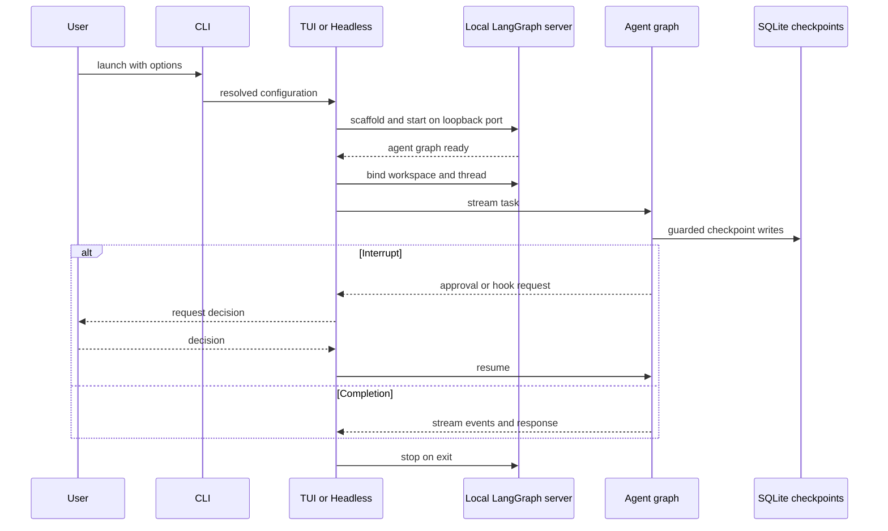
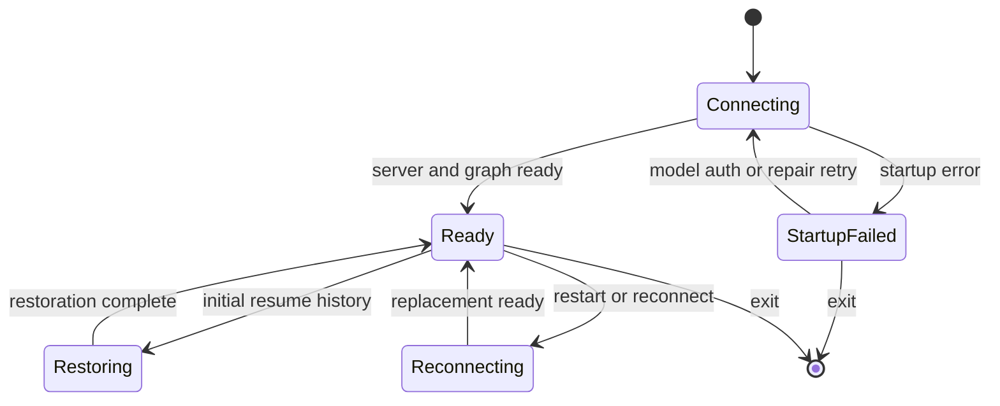

# Run and Change a dcode Session

`dcode` has three entry modes: the default Textual UI, one-task headless execution with `-n`, and an ACP server over standard input/output with `--acp`. Interactive and headless runs use a temporary local LangGraph server and a remote client; ACP is a separate stdio integration boundary. For the broader design, see [code agent architecture](../architecture/code-agent.md), [state persistence](../concepts/state-persistence.md), [costs and sessions](../operations/cost-and-sessions.md), and the [testing guide](../testing/testing-guide.md).

## Select the execution mode

```bash
# Interactive Textual UI
dcode -M anthropic:claude-sonnet-4-5

# One bounded task for automation
dcode -n "run the focused tests" --max-turns 8 --timeout 600

# Agent Client Protocol service over stdin/stdout
dcode --acp
```

Use the TUI for a durable conversation, approvals, thread selection, and interactive recovery. Use `-n` when an automation caller needs one task and an exit code: it creates an autonomous, non-interactive agent, so the system prompt directs it to make reasonable assumptions rather than ask clarifying questions. With `-q`, response text remains on stdout while headers, diagnostics, tool notifications, and errors go to stderr. `--no-stream` buffers response text until completion. A turn-budget excess and an outer `--timeout` both use exit status `124`; Ctrl-C is `130`.

`-M/--model` accepts a model specification and auto-detects its provider. `--model-params` is JSON extra model input and overrides configured values. `--max-retries N` overrides `[retries]`; `0` disables retries. Choose a summarization model separately with `--summarization-model` when context compaction needs a different model.

> **Trust before execution.** Headless project hooks are disabled unless `--trust-project-hooks` is supplied. Likewise, project stdio MCP servers are skipped unless `--trust-project-mcp` is supplied; an explicit MCP config is preflight-validated before a server is spawned. Treat project code, hooks, extensions, and MCP configuration as code-execution boundaries rather than ordinary display configuration.

## Server-backed turn execution


```mermaid
sequenceDiagram
    participant User
    participant CLI
    participant Client as TUI or Headless
    participant Server as Local LangGraph server
    participant Graph as Agent graph
    participant Store as SQLite checkpoints
    User->>CLI: launch with options
    CLI->>Client: resolved configuration
    Client->>Server: scaffold and start on loopback port
    Server-->>Client: agent graph ready
    Client->>Server: bind workspace and thread
    Client->>Graph: stream task
    Graph->>Store: guarded checkpoint writes
    alt Interrupt
        Graph-->>Client: approval or hook request
        Client-->>User: request decision
        User-->>Client: decision
        Client->>Graph: resume
    else Completion
        Graph-->>Client: stream events and response
    end
    Client->>Server: stop on exit
```

*Interactive and headless execution starts a local graph server, binds a workspace and thread, streams the graph, and tears down its owned process.*

The launch manager resolves `ServerConfig`, writes server environment values, scaffolds a fresh temporary runtime directory containing a checkpointer, `pyproject.toml`, and `langgraph.json`, starts `langgraph dev` on an ephemeral loopback port, waits for the `agent` graph, and constructs a `RemoteAgent`. It then binds the resolved workspace before returning control. If any step after process start fails or is cancelled, the manager stops the server; this must remain true for `CancelledError`, not just ordinary exceptions.

The generated checkpointer uses the normal sessions SQLite database, but wraps it in ownership fencing. A client reserves a thread with an OS file lock and an owner token. Every checkpoint mutation validates both: a stale server cannot write after its client exits, releases the lease, or another client takes ownership. The writer gate also keeps an in-flight mutation from racing a successor takeover. Do not replace this with an in-memory “active thread” flag.

## Startup and recovery lifecycle


```mermaid
stateDiagram-v2
    [*] --> Connecting
    Connecting --> Ready: server and graph ready
    Connecting --> StartupFailed: startup error
    Ready --> Restoring: initial resume history
    Restoring --> Ready: restoration complete
    Ready --> Reconnecting: restart or reconnect
    Reconnecting --> Ready: replacement ready
    StartupFailed --> Connecting: model auth or repair retry
    StartupFailed --> [*]: exit
    Ready --> [*]: exit
```

*The TUI distinguishes initial resume restoration from later server replacement and exposes a terminal startup-failure recovery state.*

`ServerReady` owns the settled transition: it clears connection and reconnect flags, installs the agent and process, refreshes MCP counters and model presentation, schedules the one-time session-start sequence, and drains deferred actions when no agent work is active. The startup sequence serializes resumed-history hydration, `--startup-cmd`, initial prompt or skill dispatch, and then user-queued messages. Do not independently drain user input before that sequence.

On the initial `-r` connection, `ServerReady` copies `_resuming` into `_restoring_resumed_history` **before** clearing connection state. Status synchronization consumes `_resuming`, so the latch preserves the “resuming” indicator while history is mounted. A reconnect must not re-arm it or reload the transcript. Startup failure clears both flags and settles connection-related UI instead of leaving it loading.

A startup error is terminal until the user repairs or replaces the configuration. The app retains formatted failure information, including missing credentials or provider-package context, while `/model` and `/auth` can open their recovery UI. `/install`, `/reload`, and `/update` remain normally queue-bound but bypass the parked queue after startup failure only when agent work, shell work, and modal commands are all idle. This narrow exemption avoids swapping an installation during a running turn.

## Durable thread selection, naming, and resume conflicts

Threads are checkpoint-backed records in the sessions SQLite store. `list_threads` returns metadata such as the ID, agent, timestamps, branch, cwd, latest checkpoint, and a durable `thread_name`. The list query uses a covering index to avoid scanning checkpoint blobs; names are fetched separately, preferring `dcode_thread_names` and falling back to the latest root-checkpoint metadata for older stores. Name a thread with `/rename`; names are trimmed, single-line printable text of 1–50 characters. The durable name wins over the initial prompt in picker and completion labels.

`/threads` opens the full selector. It can paint cached recent rows first, then reloads the chosen sort and cwd scope from disk; missing message counts and initial prompts are enriched in the background. Its default scope follows the persisted thread setting: current working directory unless configured for all directories. It can show Name alongside ID, agent, counts, timestamps, branch, location, and initial prompt. Filtering and selection remain in the modal until a valid selection succeeds.

Before dismissing the resume picker, the app checks whether it can reserve the selected thread. A thread owned elsewhere leaves the picker open, preserves its filter and highlighted row, reports the error, and does not load history or alter the active thread. Once selected, a busy agent, shell, or connection defers the switch; otherwise the app reserves the destination before loading it, retains the prior reservation on failure, and releases the old lease only after the destination becomes active.

For bare `-r` / most-recent resume, the app atomically tries recent candidates in order and skips occupied threads with a notification. If all matching candidates are occupied, it offers a fresh thread or exit rather than stealing a writer. An explicit occupied thread is not silently substituted: it fails before history loading and leaves the current thread intact.

The composer also supports named thread reference completion with `@@query`. It searches cached thread ID, durable name, initial prompt, agent, branch, and cwd; the displayed label prefers the saved name and sanitizes/truncates it. Choosing a result inserts the durable ID-only token `@@(thread:UUID)`, not the display name, so later renames cannot invalidate the reference.

## Inspect local threads without writing

Use the built-in `deepagents-thread-inspector` skill when LangSmith is unavailable, the session is offline or untraced, or an operator needs a local title, checkpoint metadata, recent thread list, or transcript. Prefer its script to ad hoc SQLite/blob decoding:

```bash
python3 "$SKILL_DIR/scripts/inspect_sessions.py" THREAD_ID --mode latest-turn
python3 "$SKILL_DIR/scripts/inspect_sessions.py" THREAD_ID --mode summary
python3 "$SKILL_DIR/scripts/inspect_sessions.py" --list 20
```

A unique ID prefix is accepted. `summary` exposes `thread.thread_name`; it uses the saved name and falls back to the latest root checkpoint’s name. If the current thread ID is unavailable, ask for it—do **not** guess that the most recently listed thread is current. Use `--include-metadata` only when run, repository, model, checkpoint, or LangGraph metadata is necessary, and `--db PATH` only for a non-default store. The default follows `DEEPAGENTS_SESSIONS_DB`, then `$DEEPAGENTS_HOME/.state/sessions.db`, then `~/.deepagents/.state/sessions.db`; invalid relative or `~user` paths are rejected.

Keep this operational path read-only. The inspector opens the store read-only and uses LangGraph’s strict MsgPack loader to reconstruct root-channel messages from the latest checkpoint or ordered writes. Only deserialize trusted local Deep Agents state. Summarize output rather than dumping it, disclose reconstruction warnings and content truncation, and do not reveal unrelated credentials, personal data, or hidden reasoning. Do not mutate or delete session rows unless the user has separately and explicitly requested it.

## Queue and command changes

`COMMANDS` in `command_registry.py` is the single declaration point for static slash commands: canonical name, aliases, description, autocomplete hints, experimental visibility, and queue tier. The registry derives each tier’s set—including aliases—and autocomplete filters experimental entries unless experimental mode is enabled. Regenerate `COMMANDS.md` with `make commands-catalog` after changing catalog metadata; it is generated and must not be edited manually.

| Tier | Meaning |
| --- | --- |
| `ALWAYS` | Execute regardless of busy state; reserve for quit, restart, and recovery behavior. |
| `CONNECTING` | Execute only during initial connection when no work is active. |
| `IMMEDIATE_UI` | Open a modal immediately; defer its actual work. Bare commands only, except explicit selector-only forms. |
| `SIDE_EFFECT_FREE` | Perform a safe immediate side effect while delaying chat output as needed. |
| `QUEUED` | Wait for idle; this is the default for session and graph mutations. |

`_can_bypass_queue` normalizes input and applies those sets. Exact `IMMEDIATE_UI_ARG_FORMS` exist for selector forms such as `/auto model` and `/offload model`; argument forms that mutate state stay queued. Dynamic `/skill:<name>` completions are discovered separately from static command aliases. The autocomplete controller displays a friendly skill label where appropriate but inserts its canonical machine name, preserving namespaced plugin skill identity.

## Model retries, hooks, and prompt-cache notices

Model retry is intentionally scoped to the model node, not the entire graph turn. Completed tools therefore do not replay after a transient provider failure. The middleware classifies transport, selected status-code, and provider SDK failures; applies jittered exponential backoff or a bounded `Retry-After`; and emits attempt/retry events. Clients use those events to mark streamed partial output as incomplete and distinguish a replay from a final response. Preserve that event contract when changing retry behavior.

Client lifecycle hooks are active in headless execution as well as the TUI. They can observe stream and session events, and a hook stop is an intentional outcome rather than an unhandled failure. Drain pending hooks at session end, including after interrupts or stream failures, so lifecycle work is not silently abandoned.

The TUI tracks cache activity from checkpointed model state. Near the end of a retention window it emits one warning per thread/window and hook notification. Once expired, the `warnings.cache_prompt = "expiry"` policy offers a cache handoff only while the application is genuinely idle; it will not interrupt an active agent, shell, queue, thread switch, startup sequence, or modal. A submitted interactive message can instead offer handoff, send in the current thread, or cancel; handoff and cancellation restore the draft. Failures in cold-cache estimation fail open with a one-time notice rather than blocking a message indefinitely.

## Focused validation

Run checks from `libs/code` and start with the boundary changed:

```bash
make commands-catalog
make test TEST_FILE=tests/unit_tests/test_app.py
make test TEST_FILE=tests/unit_tests/test_app_thread_ownership.py
make test TEST_FILE=tests/unit_tests/test_sessions.py
make test TEST_FILE=tests/unit_tests/test_thread_naming_app.py
make test TEST_FILE=tests/unit_tests/tui/widgets/test_thread_selector.py
make test TEST_FILE=tests/unit_tests/tui/widgets/test_autocomplete.py
make test TEST_FILE=tests/unit_tests/skills/test_thread_inspector.py
make test TEST_FILE=tests/unit_tests/test_non_interactive.py
make test TEST_FILE=tests/unit_tests/test_thread_ownership.py
make test TEST_FILE=tests/unit_tests/test_cache_expiry.py
make test TEST_FILE=tests/unit_tests/test_command_registry.py
make test TEST_FILE=tests/unit_tests/test_model_retry.py
make check
```

For server-ready work, call the real event handler under `run_test()` and assert the resume latch precedes connection clearing, failure clears it, and a replacement server does not resurrect it. For startup recovery, cover both idle bypass and each busy guard. For command catalog changes, verify aliases, tier derivation, experimental filtering, autocomplete insertion, and the generated catalog. For thread work, test durable name precedence and validation, scoped/sorted selector refresh, and that an ownership conflict keeps the selector, filter, selection, active thread, and transcript unchanged. Test most-recent resume skipping occupied candidates and explicit conflict rejection. For inspector changes, test read-only access, title fallback, prefix selection, warnings, and sensitive-output handling. For ownership changes, use separate processes or leases: assert same-thread exclusion, client-exit fencing, stale-token rejection, and takeover only after the writer gate releases.
