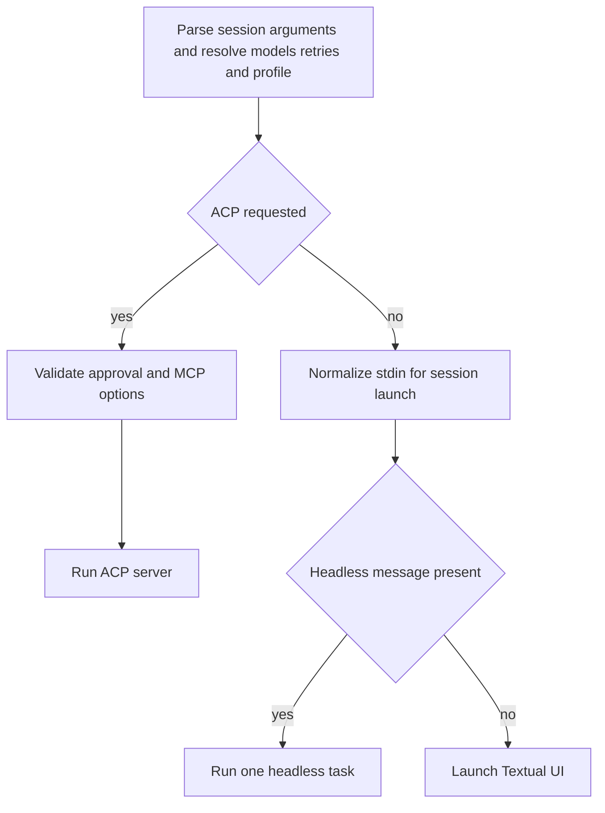
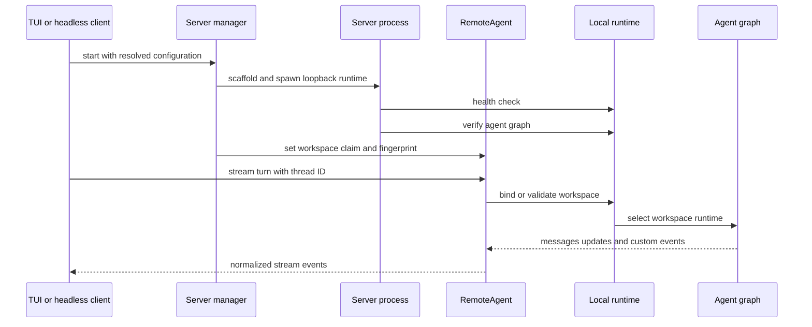
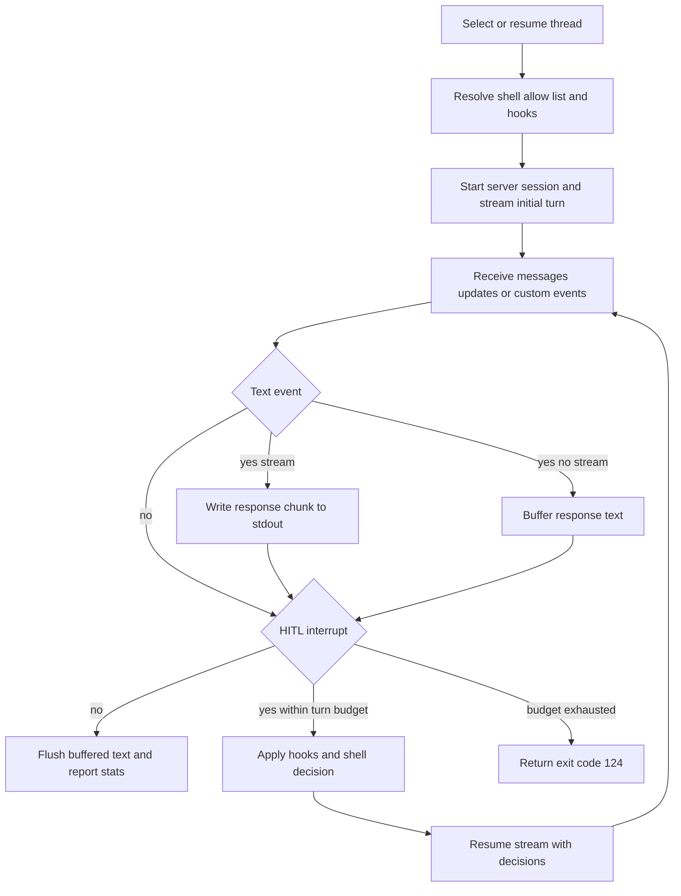

# Run a dcode Session

`dcode` offers three execution surfaces: the interactive Textual UI, a one-task headless run, and ACP. Interactive and headless execution use an app-owned loopback LangGraph server through `RemoteAgent`; ACP dispatches earlier to its protocol server. The server, rather than the client, authorizes a thread's durable workspace and selected runtime. See [code agent architecture](../architecture/code-agent.md), [runtime behavior](../architecture/runtime-behavior.md), [configuration layering](../concepts/config-layering.md), [ACP](../integrations/acp.md), and [cost and sessions](../operations/cost-and-sessions.md).

## Choose the execution surface

```bash
# Interactive UI, optionally with an initial prompt
dcode -M anthropic:claude-sonnet-4-5 -m "review this repository"

# One bounded headless task
dcode -n "run the focused tests" --max-turns 8 --timeout 600

# Explicit stdin becomes a headless task
git diff | dcode --stdin --skill code-review -q

# Agent Client Protocol service
dcode --acp
```

Before dispatch, the CLI parses `--model-params` and `--profile-override`, resolves the summarization model once, and determines retry settings for the provider that will build the selected model. dcode owns the retry budget: provider retry parameters passed through `--model-params` are overridden, so use `--max-retries` or `[retries].max_retries` instead.

ACP is selected **before** stdin is processed. It resolves approval mode, requires a prior interactive acknowledgement for YOLO, accepts `--auto-classifier-model` only for Auto mode, and rejects the `--no-mcp` plus `--mcp-config` combination. For non-ACP session launches, stdin normalization determines the surface: a final nonempty `non_interactive_message` runs headless; otherwise dcode opens the TUI.


```mermaid
flowchart TD
    Parse["Parse session arguments and resolve models retries and profile"] --> ACPChoice{"ACP requested"}
    ACPChoice -->|yes| ACPCheck["Validate approval and MCP options"]
    ACPCheck --> ACPRun["Run ACP server"]
    ACPChoice -->|no| Normalize["Normalize stdin for session launch"]
    Normalize --> HeadlessChoice{"Headless message present"}
    HeadlessChoice -->|yes| HeadlessRun["Run one headless task"]
    HeadlessChoice -->|no| TUIRun["Launch Textual UI"]
```

*ACP bypasses stdin-based mode selection; stdin only decides between the non-ACP surfaces.*

### Session-only argument rules

- `--max-turns`, `--timeout`, `--quiet`, `--no-stream`, and rubric options require a headless message. `--goal` is interactive-only and cannot be combined with an initial message or skill.
- `--auto-classifier-model` is rejected for headless runs and sandboxed interactive runs. An explicit `--auto-approve` or `--yolo` in headless mode is warned about and ignored.
- `--no-mcp` and `--mcp-config` are mutually exclusive. An explicit MCP configuration is preflight-validated before local-server spawn.
- Help-only and completion invocations use lightweight paths; session launches initialize credentials only after argument parsing and the bare-help fast path.

## Local runtime startup and workspace handoff

The TUI and headless runner enter `start_server_and_get_agent`—headless via `server_session`. It captures the project context, validates MCP input, derives `ServerConfig`, scaffolds an owned temporary runtime directory, and launches a loopback `langgraph dev` subprocess. The manager waits for HTTP health and then `GET /assistants/agent/graph`; the graph request forces lazy construction so credential, provider, sandbox, and marked startup failures occur before an agent is handed to the caller.

Once both gates succeed, the manager creates `RemoteAgent` and assigns the cwd, workspace-policy claim, and fingerprint. On every streamed turn, `RemoteAgent` binds or verifies the thread through the workspace route, sends the returned descriptor as run context, and uses thread-ownership headers while removing an incompatible configurable owner value. The server canonicalizes the directory, refuses client assertions of project workspace policy, durably binds a new thread, builds or validates the selected runtime before replying, and returns workspace conflicts as HTTP 409.


```mermaid
sequenceDiagram
    participant Client as TUI or headless client
    participant Manager as Server manager
    participant Process as Server process
    participant Remote as RemoteAgent
    participant Runtime as Local runtime
    participant Graph as Agent graph
    Client->>Manager: start with resolved configuration
    Manager->>Process: scaffold and spawn loopback runtime
    Process->>Runtime: health check
    Process->>Runtime: verify agent graph
    Manager->>Remote: set workspace claim and fingerprint
    Client->>Remote: stream turn with thread ID
    Remote->>Runtime: bind or validate workspace
    Runtime->>Graph: select workspace runtime
    Graph-->>Remote: messages updates and custom events
    Remote-->>Client: normalized stream events
```

*The graph is not exposed to a session client until both health and graph readiness succeed, and runtime selection is server-validated.*

Startup cleanup is cancellation-safe. `ServerProcess.start()` serializes lifecycle work and reaps a child if spawning, its post-spawn gate, or health checking fails or is cancelled. If graph readiness or workspace setup fails after startup, `start_server_and_get_agent` stops the unhanded server. `PrespawnedServer` may overlap child spawning with TUI first paint, but cancellation reaps an unadopted prespawn.

The server child environment pins the chosen profile and prevents persistent or scoped overrides from replacing the profile, inherited `PYTHONPATH`, or LangSmith carrier values. This preserves a consistent server configuration while keeping unsafe interpreter-path injection out of server startup.

## Headless policy, stream loop, and statistics

A headless run is deliberately non-interactive. Its actual approval behavior is derived from `--shell-allow-list`, not the ignored `--auto-approve` or `--yolo` flags:

- no allow-list disables shell access and auto-approves other tools;
- `recommended` or a concrete list enables shell access but interrupts only shell calls for allow-list enforcement;
- `all` enables unrestricted shell access and auto-approves all tools.

Permission-request hooks override the middleware shortcuts so gated calls reach those hooks. Project hooks are not trusted by default—even persisted interactive trust does not carry into a headless invocation—and require `--trust-project-hooks`.

`--quiet` routes status, headers, tool notices, HITL decisions, and errors to stderr so response text remains usable on stdout; it still emits the thread identifier for later resume. Normal streaming writes response chunks immediately. `--no-stream` buffers response text until completion, while reasoning stays on stderr and is not folded into the final response. In a non-quiet session, the runner records invocation statistics and, when enabled, prints a usage table with wall-clock duration; a completed background LangSmith thread-link lookup can also be shown without delaying completion.


```mermaid
flowchart TD
    Begin["Select or resume thread"] --> Policy["Resolve shell allow list and hooks"]
    Policy --> Session["Start server session and stream initial turn"]
    Session --> Event["Receive messages updates or custom events"]
    Event --> Output{"Text event"}
    Output -->|yes stream| WriteNow["Write response chunk to stdout"]
    Output -->|yes no stream| Buffer["Buffer response text"]
    Output -->|no| Interrupt{"HITL interrupt"}
    WriteNow --> Interrupt
    Buffer --> Interrupt
    Interrupt -->|no| Finish["Flush buffered text and report stats"]
    Interrupt -->|yes within turn budget| Decide["Apply hooks and shell decision"]
    Decide --> Resume["Resume stream with decisions"]
    Resume --> Event
    Interrupt -->|budget exhausted| Limit["Return exit code 124"]
```

*Headless streaming sends text incrementally unless `--no-stream` is selected; interrupts resume the same run only while the total-turn budget permits it.*

The initial stream counts as turn 1 and each HITL resume consumes another turn. If `--max-turns` is omitted, an internal safety default bounds the loop. The runner checks the limit before another resume, returns exit code 124 when it is exhausted, and asks the operator to adjust the task or shell allow-list. It streams `messages`, `updates`, and `custom` events with subgraphs, reconciles tool lifecycle events, and keeps a request ledger so replayed chunks do not double-count usage. On cancellation or error it ends the hook session, drains pending hook tasks without replacing the selected exit code, and releases a resumed thread's ownership lease.

`--startup-cmd` is local pre-agent shell work, not prompt context. Its output follows normal console routing; launch failure, a 60-second timeout, and nonzero exit warn but do not abort the task. Cancellation terminates and reaps it.

## Resume and failure handling

Headless execution chooses its thread before server startup. A new invocation generates a new ID. `-r <id>` never degrades to a new thread: it verifies existence and resume-age policy, rejects a mismatched or unavailable persisted directory, and reserves the existing thread before startup. It may adopt the saved agent and—unless `-M` was supplied—the saved model. If the saved model cannot be resolved, it warns and continues with the launch model; a workspace conflict remains fatal.

Remote cancellation is best effort for active runs. When a recovery-state write conflicts because the server still sees the thread as busy, the client cancels pending and running runs with bounded waits and retries that write once.

At local-server startup, the lifespan can patch a compatible in-memory run scheduler to wake on insertion and begins building the cached runtime while the client waits for health. Shutdown cancels that prebuild, shuts down extensions, and performs a bounded best-effort LangSmith trace flush. Workspace runtimes snapshot workspace environment and pin compatible tracing settings; thread leases and ownership tokens fence stale checkpoint writers.

## Stop and diagnose safely

`ServerProcess` serializes asynchronous start and restart actions, while a state lock protects synchronous teardown. Terminal `stop()` is idempotent and increments a stop generation. A restart captures that generation before stopping its old child; if a terminal stop wins the race, the replacement spawn is cancelled rather than recreating the server.

On POSIX, bootstrap uses a parent-death pipe and a dedicated process group. EOF before dispatch suppresses launch; EOF after dispatch triggers termination. Normal shutdown signals only that group with `SIGTERM`, waits, then escalates to `SIGKILL`, and refuses to signal dcode's own group. Windows attempts Ctrl+Break and finally terminates the root process, so descendants may survive and are reported. Debug mode preserves and announces server logs after terminal restoration; ordinary teardown removes them.

## Focused validation

Run focused tests from `libs/code` when modifying this workflow:

```bash
make test TEST_FILE=tests/unit_tests/test_startup_fast_paths.py
make test TEST_FILE=tests/unit_tests/test_non_interactive.py
make test TEST_FILE=tests/unit_tests/test_headless_resume.py
make test TEST_FILE=tests/unit_tests/test_main_args.py
make test TEST_FILE=tests/unit_tests/test_remote_client.py
make test TEST_FILE=tests/unit_tests/test_server_manager.py
```

Protect mode routing before stdin processing, headless-only argument errors, shell allow-list policy, quiet/no-stream routing, hook trust, HITL turn accounting, and exit code 124. For startup changes, cover health plus graph readiness and cancellation cleanup. For resumes and workspace work, cover no-fallback resume behavior, ownership reservation, server-side workspace claims, 409 conflicts, cancellation, and the single recovery-write retry.
