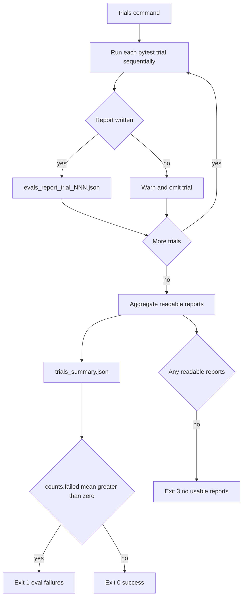

# Run and Interpret Evals

`libs/evals` is the end-to-end behavioral evaluation suite for the Deep Agents SDK. Each eval runs a real LLM, records the agent trajectory—including tool calls, file mutations, and final response—and scores correctness and efficiency. It complements, rather than replaces, deterministic unit tests: use the latter for harness mechanics and the real-model suite for a behavioral or model-quality conclusion.

Related guidance: [development](../operations/development.md), [security](../operations/security.md), [cost and sessions](../operations/cost-and-sessions.md), and the [testing guide](../testing/testing-guide.md).

## Choose an evaluation boundary

| Question | Entry point | Result |
| --- | --- | --- |
| Did deterministic eval tooling change correctly? | `make test` | Unit tests in `tests/unit_tests`, with network sockets disabled except Unix sockets. |
| Does one model exhibit an SDK behavior? | `deepagents-evals run` | One traced pytest rollout. |
| Is a model-sensitive result repeatable? | `deepagents-evals trials` | Per-trial reports and aggregate statistics. |
| Can the agent solve external sandbox tasks? | Harbor targets or `harbor run` | Task-owned verification and sandbox trajectory. |
| How do models compare on external capability axes? | `unified_evals.yml` | Cross-model leaderboard and, with enough axes, radar chart. |

Start deterministic work from `libs/evals`:

```sh
uv sync --all-groups
make test TEST_FILE=tests/unit_tests/
make test TEST_FILE=tests/unit_tests/test_harbor_langgraph_agent.py
```

`make evals` is not an offline test target: it invokes real models and requires tracing credentials.

## Credentials and single-run entrypoints

The canonical interface is the `deepagents-evals` console script, registered as `deepagents_evals.cli:main`. Its subcommands are `run`, `trials`, `aggregate`, `radar`, `catalog`, `model-groups`, and `list`. `list` discovers categories, tiers, model registry entries, and AST-visible evals without importing real-model test modules. Most execution and maintenance subcommands offer `--json` for structured stdout and `--dry-run` for preview.

The eval pytest configuration aborts if tracing is not enabled or no model is supplied. Enable one recognized tracing flag and provide `LANGSMITH_API_KEY`; also export the provider credential for the chosen model.

```sh
cd libs/evals
uv sync --all-groups
export LANGSMITH_TRACING=true
export LANGSMITH_API_KEY=...
export ANTHROPIC_API_KEY=...

# Inspect available values before spending a rollout.
deepagents-evals list categories
deepagents-evals list tiers
deepagents-evals list models --group set0
deepagents-evals list evals --category tool_use

# Execute a narrow, report-producing run.
deepagents-evals run --model anthropic:claude-opus-4-7 \
  --eval-category tool_use --eval-tier baseline --report evals_report.json
```

`run` executes `uv run --group test pytest tests/evals` from `libs/evals` and forwards model, category, tier, OpenRouter, reasoning, REPL, report, and extra pytest arguments. `--model` overrides `DEEPAGENTS_EVALS_MODEL`; the environment variable supplies the default if the flag is omitted. If neither resolves, the CLI exits with configuration code `2` and shows known model groups.

Categories and labels come from `deepagents_evals/categories.json`; tiers are `baseline` (regression gate) and `hillclimb` (progress tracking). Repeated category filters are inclusive, but an `--eval-category-exclude` match wins; invalid filters fail after collection. For repeatable routing, use `--openrouter-provider` only with an `openrouter:` model and leave fallbacks disabled unless `--openrouter-allow-fallbacks` is explicitly intended. `--openai-reasoning-effort` is only valid for `openai:` models.

The CI-compatible Makefile remains useful:

```sh
make evals MODEL=anthropic:claude-opus-4-7
make evals-trials MODEL=openai:gpt-5.5 TRIALS=3 \
  TRIAL_ARGS="--eval-category memory"
```

Both targets fail fast if their required variables are missing. `make evals` runs the real suite directly; `make evals-trials` invokes `scripts/run_trials.py`. Prefer the console CLI when discovery, JSON output, retrying, or aggregation is needed.

## What a pytest eval measures

A normal eval is a `@pytest.mark.langsmith` test that receives a model fixture, builds an agent—normally with `create_deep_agent(...)`—and drives it through `run_agent(...)` with a `TrajectoryScorer`. `run_agent` constructs inputs from the query, optional initial files, and extra state; invokes the graph with a thread ID; logs inputs and outputs to LangSmith; turns the result into an `AgentTrajectory`; then applies the scorer.

The scorer has two intentional assertion tiers:

- `TrajectoryScorer.success(...)` is correctness evidence. A failed assertion fails the test.
- `TrajectoryScorer.expect(...)` records expected trajectory shape, such as step or tool-call behavior, but never fails the test.

Keep alternate valid solution paths viable by using `expect` for efficiency diagnostics, and promote an expectation to `success` only when it is essential to correctness. Inspect the LangSmith trace alongside the report to understand a hard failure rather than treating a score alone as a root cause.

## Trial execution, artifacts, and exit status

Use repeated trials for comparisons. One rollout is a diagnostic observation, not evidence that a stochastic model change is stable.

```sh
deepagents-evals trials --model openai:gpt-5.5 --trials 3 \
  --eval-category memory --out-dir trial_runs/memory

# Merge reports downloaded from separate CI jobs.
deepagents-evals aggregate trial_runs/memory --summary-out summary.json

# Retry every distinct node ID that failed in a prior sweep.
deepagents-evals trials --model openai:gpt-5.5 --trials 1 \
  --retry-failed trial_runs/memory/trials_summary.json
```



Caption: a trial sweep retains readable artifacts even when a trial process has problems, then uses the aggregate failure count—not the pytest return code—to determine the CLI result.

Within one `run_trials` invocation, trials are sequential because in-process LangSmith experiment creation and provider rate limits are unsafe for parallel execution. The GitHub Actions N-trial workflow can fan trials out into separate jobs and aggregate uploaded artifacts afterward; it defaults to `max-parallel: 1` and should be made parallel only when the provider can absorb the request burst.

A live sweep writes `evals_report_trial_NNN.json` and aggregates readable reports into `trials_summary.json`. The summary has metric and count statistics (`n`, mean, median, sample standard deviation, minimum, maximum) for correctness, solve rate, step ratio, tool-call ratio, median duration, and passed/failed/skipped/total, plus per-category correctness. Null values do not enter a metric sample; non-numeric values are warned about and excluded. Mixed model or SDK versions produce warnings and should not support a regression conclusion.

`--retry-failed` accepts a summary path or report directory, scans the associated reports for `failures[].test_name`, and deduplicates node IDs: a test that flakes once is retried once. It returns `3` if it finds no retryable IDs, including when reports exist but none parse.

| Exit code | Automation meaning |
| --- | --- |
| `0` | Successful command or aggregate with no failed tests. |
| `1` | Eval failure: a `run` pytest failure, aggregate `counts.failed.mean > 0`, or radar-generation failure. |
| `2` | Configuration or usage error, registry load failure, or stale generated output detected by `--check`. |
| `3` | No usable report or no parseable prior reports for retry. |

The pytest reporter deliberately rewrites its session exit status to `0` after test calls. Therefore `pytest_returncode` is not the trial/aggregate failure signal; use `trials_summary.json` at `counts.failed.mean`.

## Generated metadata and focused maintenance tests

`EVAL_CATALOG.md` is generated from AST-visible evals under `tests/evals/`; do not edit it manually. The catalog check is also a unit-tested invariant.

```sh
make eval-catalog
deepagents-evals catalog --check
make test TEST_FILE=tests/unit_tests/test_eval_catalog.py
```

Model specs and named groups are curated in `.github/scripts/evals/models.py`; `MODEL_GROUPS.md` is generated from that registry. Groups include sets such as `set0`, `set1`, `frontier`, `fast`, `open`, and `docs`, as well as provider groups. Run `deepagents-evals model-groups --check` and `deepagents-evals catalog --check` in maintenance or CI: their drift failures map to exit `2`, not an evaluation regression.

When changing Harbor’s LangGraph agent, run `make test TEST_FILE=tests/unit_tests/test_harbor_langgraph_agent.py`. These tests verify graph registration and dependency declarations, prevent accidental tracing egress in tool tests, test bounded web-search behavior, ensure model identity does not leak across tests, and verify that shell construction cannot inherit provider or LangSmith credentials.

## Harbor: sandbox boundary and constraints

Harbor runs benchmark tasks in task sandboxes rather than through the pytest behavioral harness. `deepagents_harbor` owns the Deep Agents-side LangSmith and failure-classification integration. Its `langgraph_project/langgraph.json` is the dependency source of truth for the agent environment and registers the `dcode`, `bare`, and `tau3` graphs.

Stage local checkouts before commands that install into Harbor sandboxes:

```sh
cd libs/evals
make stage-harbor-local-deps
make run-hello-world MODEL=anthropic:claude-opus-4-7
make run-terminal-bench-docker MODEL=anthropic:claude-opus-4-7
```

Staging copies the checked-out Deep Agents, deepagents-code, ACP, and QuickJS packages under `.local_deps`. The terminal-bench targets select Docker, Modal, Daytona, Runloop, or LangSmith environments and configure different sandbox concurrency. Treat `-n` as concurrent sandbox trials, not task count.

The Harbor agent removes provider and LangSmith credential variables while constructing the local shell-backed agent and restores them afterward. This boundary prevents task shell commands from inheriting those secrets; do not weaken it. The optional research web-search tool is gated on `TAVILY_API_KEY` and bounds both returned result count and rendered output size.

Interpret failures before attributing them to model capability. `FailureCategory` distinguishes `CAPABILITY` from `INFRA_OOM` (exit 137), `INFRA_TIMEOUT` (exit 124), and `INFRA_SANDBOX`; it also has `UNKNOWN` for unclassifiable results. Retry or repair infrastructure outcomes rather than reporting them as model regressions.

## Unified cross-model evaluation

The dispatchable `.github/workflows/unified_evals.yml` applies a fixed external battery to comma-separated `provider:model` specifications. It defaults to autonomous, conversation, and research; context is opt-in. Keep model, task profile, rollouts, agent implementation, grader, and sandbox conditions constant for a meaningful before/after comparison.

| Capability axis | Benchmark | Agent runtime |
| --- | --- | --- |
| Autonomous | `harbor-index/harbor-index` | `bare` or `dcode` |
| Conversation | `tau3-subset` | `tau3` |
| Context | `context-retrieval-evals` | `bare` or `dcode` |
| Research | `drbench-evals` | `bare` or `dcode` |

Conversation is bound to `tau3` because its MCP-hosted user simulator drives the required multi-turn protocol. The other axes may use the neutral `create_deep_agent` graph (`bare`) or the product agent (`dcode`). The workflow publishes a leaderboard and emits a radar chart once at least three axes run.

For pass/fail task axes, read pass@K as the fraction of tasks that pass at least once in K rollouts. `avg@K` is passing trials divided by expected trials, so missing rollouts count as failures. Research uses a continuous reward, so its pass@K is structurally zero and the useful result is avg@K; changing its judge requires a new baseline rather than a direct comparison.

```sh
gh workflow run unified_evals.yml \
  -f models="anthropic:claude-opus-4-7,openai:gpt-5.5" \
  -f categories="autonomous,conversation,research" \
  -f agent_impls="bare" \
  -f rollouts="3"
```

The workflow exposes task profile and inclusion filters, retries, timeout multiplier, concurrency, sandbox, forced-build, branch comparison, Harbor package override, and judge-model controls. The research category intentionally pins an arm runner, Docker sandbox, and concurrency `1`; it alone receives `TAVILY_API_KEY` because it needs open-web research. Do not put credentials in a `harbor_package_override`; the workflow deliberately reports only whether an override was supplied.

## Safe extension loop

1. Write focused deterministic coverage for harness, report, or adapter behavior.
2. Add a narrow traced eval with category and tier markers, hard correctness checks, and diagnostic efficiency expectations.
3. Regenerate the catalog and update category metadata when the taxonomy changes.
4. Inspect traces and per-run reports, then use multiple trials before claiming a model-sensitive change.
5. For Harbor and unified results, retain configuration and artifacts, classify infrastructure failures, and compare only like-for-like runs.
