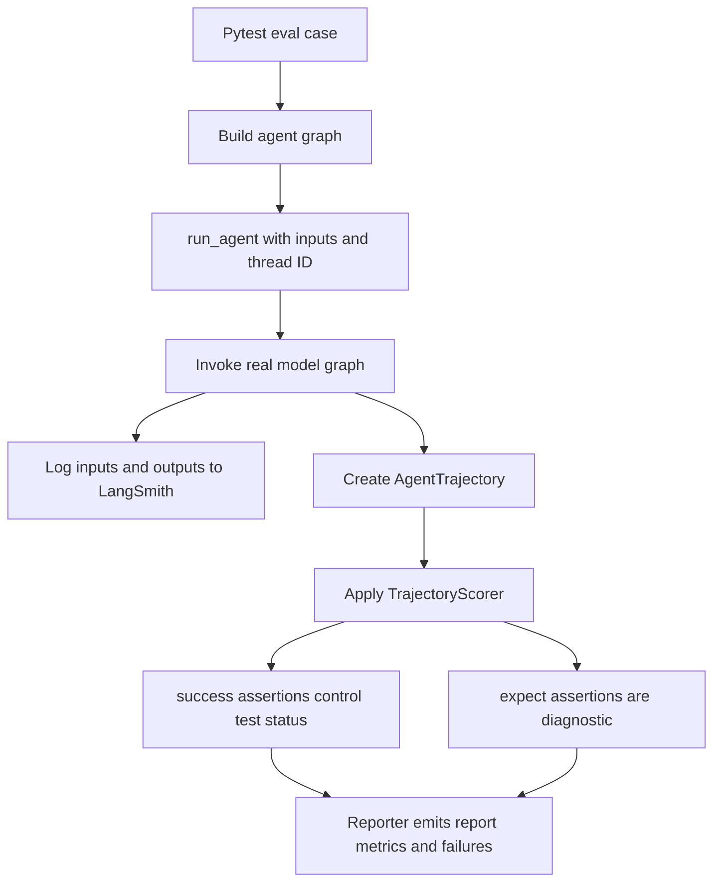

# Run Evals and Harbor Benchmarks

`libs/evals` is the real-model behavioral suite for the Deep Agents SDK. A normal eval invokes an agent against a real LLM, preserves the resulting tool calls, file mutations, and answer as a trajectory, and scores both correctness and efficiency. It is deliberately distinct from deterministic tests: use the latter to validate the harness and integrations without model cost or variability; use an eval to make a traced claim about agent behavior.

See [development](../operations/development.md), the [testing guide](../testing/testing-guide.md), the [architecture overview](../architecture/overview.md), and [sandbox partners](../integrations/sandbox-partners.md) for adjacent concerns.

## Pick the execution boundary

| Question | Entry point | Evidence produced |
| --- | --- | --- |
| Did a CLI, reporter, catalog generator, or Harbor adapter change behave deterministically? | `make test` | Offline unit-test result. Network sockets are disabled except Unix sockets. |
| Did one selected LLM exhibit the intended SDK behavior? | `deepagents-evals run` | One LangSmith-traced pytest rollout and optional report. |
| Is a model-sensitive result repeatable? | `deepagents-evals trials` | Per-trial reports plus an aggregate summary. |
| Can the agent complete externally verified sandbox tasks? | Harbor `make` targets or workflows | Harbor task jobs, trajectories, and task-owned verification. |
| How do models compare on a fixed cross-capability battery? | `.github/workflows/unified_evals.yml` | Per-axis Harbor results and a combined comparison. |

From `libs/evals`, run focused deterministic coverage first:

```sh
uv sync --all-groups
make test TEST_FILE=tests/unit_tests/
make test TEST_FILE=tests/unit_tests/test_eval_catalog.py
```

`make evals` is not a substitute for `make test`: it calls `pytest tests/evals` with a real model.

## Real-model eval lifecycle

A conventional eval is a `@pytest.mark.langsmith` function. It receives the `model` fixture, builds an agent—usually with `create_deep_agent(...)`—and calls `run_agent(...)` or `run_agent_async(...)` with a `TrajectoryScorer`. Invocation inputs combine the user query, optional seeded files, and optional middleware state. `run_agent` supplies a thread ID, records compact inputs and raw outputs in LangSmith, requires a mapping result, converts it to an `AgentTrajectory`, then applies the scorer.



Caption: a traced graph invocation becomes a trajectory; correctness gates the test while trajectory-shape expectations remain diagnostic.

### Scoring invariant

- `TrajectoryScorer.success(...)` assertions are correctness checks. A failure calls `pytest.fail` and records correctness feedback of zero.
- `TrajectoryScorer.expect(...)` assertions express efficiency or trajectory-shape expectations, such as steps or tool calls. Deviations are logged but do not fail the eval.

This separation lets valid alternate strategies pass. Make an assertion hard only when the behavior is genuinely required, not merely the preferred path.

## Prerequisites and a narrow first run

Real-model evals will not start without tracing. Before running, enable one of the accepted LangSmith/LangChain tracing variables—normally `LANGSMITH_TRACING=true`—and provide `LANGSMITH_API_KEY`. Also provide the provider credential appropriate to the chosen model, such as `ANTHROPIC_API_KEY` or `OPENAI_API_KEY`. The eval collector separately requires a model.

```sh
cd libs/evals
uv sync --all-groups
export LANGSMITH_TRACING=true
export LANGSMITH_API_KEY=...
export ANTHROPIC_API_KEY=...

# Discovery does not import the costly eval test modules.
deepagents-evals list categories
deepagents-evals list tiers
deepagents-evals list models --group set0
deepagents-evals list evals --category tool_use

# Start with a bounded slice and retain its report.
deepagents-evals run --model claude-opus-5 \
  --eval-category tool_use --eval-tier baseline --report evals_report.json
```

`deepagents-evals` is the canonical interface: `run`, `trials`, `aggregate`, `radar`, `catalog`, `model-groups`, and `list` cover execution, reporting, generated documentation, and discovery. `run` shells out from `libs/evals` to `uv run --group test pytest tests/evals`, forwarding the model, category, tier, provider, reasoning, REPL, report, and trailing pytest options.

`--model` overrides `DEEPAGENTS_EVALS_MODEL`; the environment variable is a useful default for `run`, `trials`, and direct `scripts/run_trials.py` usage. For a single run, include filters and exclude filters are checked against collected markers, and exclusion wins on conflict. Provider routing is guarded: `--openrouter-provider` requires an `openrouter:` model and `--openrouter-allow-fallbacks` requires that pin; OpenAI reasoning effort requires an `openai:` model.

The Makefile preserves CI-compatible forms:

```sh
make evals MODEL=claude-opus-5
make evals-trials MODEL=openai:gpt-6-astra TRIALS=3 \
  TRIAL_ARGS="--eval-category memory"
```

These targets fail early when required variables are absent. Use CLI help for the complete interface; most subcommands support `--json` for structured stdout and `--dry-run` for a non-executing preview.

## Taxonomy and generated discovery

`EVAL_CATALOG.md` is generated from AST-visible eval functions under `tests/evals/`; do not hand-edit it. The catalog unit test runs its generator with `--check`, so follow an eval addition, rename, removal, or retagging with:

```sh
make eval-catalog
make test TEST_FILE=tests/unit_tests/test_eval_catalog.py
```

Categories and labels live centrally in `deepagents_evals/categories.json`; `radar_categories` intentionally leaves out `unit_test` and `langchain/middleware`. The two tiers are `baseline` for regression gating and `hillclimb` for progress tracking. Add a category to the JSON, mark its evals with `eval_category` and `eval_tier`, update category-tagging coverage, then regenerate the catalog.

`list` reads categories from JSON, fixed tier values, model groups from `.github/scripts/evals/models.py`, and evals through the catalog generator's AST walker rather than importing test modules. The registry is also the source for named model groups and generated `MODEL_GROUPS.md`. In CI or maintenance, `deepagents-evals catalog --check` and `deepagents-evals model-groups --check` distinguish generated-file drift from behavioral failure.

## Trials, reports, retries, and exit status

Use multiple rollouts before declaring a model delta:

```sh
deepagents-evals trials --model openai:gpt-6-astra --trials 3 \
  --eval-category memory --out-dir trial_runs/memory

# Merge reports recursively after CI fan-out.
deepagents-evals aggregate trial_runs/memory

# Retry each failed pytest node ID once.
deepagents-evals trials --model openai:gpt-6-astra --trials 1 \
  --retry-failed trial_runs/memory/trials_summary.json
```

A local trial invocation is intentionally sequential: in-process parallel creation of LangSmith experiments and provider rate limits are unsafe. The N-trial Actions workflow fans trials into jobs instead; it defaults to `max-parallel: 1`, permits an explicit provider-safe parallel burst, uploads unique reports, then aggregates them.

Each local trial writes `evals_report_trial_NNN.json`; the reporter supplies metrics and a `failures` array. `trials` and `aggregate` produce `trials_summary.json`. The summary carries `n_trials`, first-report model and SDK version, scalar metric statistics, count statistics, category-score statistics, and trimmed trial records including LangSmith experiment URLs. Every statistic has `n`, `mean`, `median`, sample `stdev`, `min`, and `max`; `stdev` is null below two samples. Missing or null metrics do not count as samples, while non-numeric values are omitted with a warning. Mixed model or SDK versions also warn because the aggregate adopts the first report's value.

Retry reads `failures[].test_name` from per-trial reports found under the supplied summary's directory or an explicit directory and deduplicates IDs across trials. A malformed report warns rather than poisoning a sweep, but retry exits with no-usable-reports status when no failed IDs are found or every discovered report is unparseable.

### Machine-consumable contract

Automations should use process status and JSON/report files, never scrape the human summary.

| Code | Meaning |
| --- | --- |
| `0` | Success. |
| `1` | Eval failure: `run` observed nonzero pytest; `trials` or `aggregate` has `counts.failed.mean > 0`; or radar failed. |
| `2` | Configuration or usage failure, model-registry failure, or stale output from `catalog --check` or `model-groups --check`. |
| `3` | No usable reports: no produced/readable summary, or retry could not obtain usable failed reports. |

The pytest reporter rewrites its session status to zero even if individual evals fail. Consequently `pytest_returncode` is not the authoritative trial result; it can be absent in report-only aggregation and a nonzero subprocess return can coexist with an aggregatable report. Determine behavioral failure from `trials_summary.json` at `counts.failed.mean`.

## Harbor sandbox benchmarks

Harbor is a separate boundary from pytest evals: it runs a LangGraph Deep Agents implementation in task sandboxes, where the benchmark owns task verification. `deepagents_harbor` owns the Deep Agents side of that boundary, including LangSmith dataset, experiment, and feedback plumbing plus trial-failure classification. `langgraph_project/langgraph.json` is the installation manifest and graph registry for the sandbox agent: it exposes `bare`, `dcode`, and `tau3`.

For a local smoke test or Terminal Bench run, stage checked-out packages into the sandbox project first:

```sh
cd libs/evals
make stage-harbor-local-deps
make run-hello-world MODEL=anthropic:claude-opus-5
make run-terminal-bench-docker MODEL=anthropic:claude-opus-5
```

Staging synchronizes Deep Agents, deepagents-code, ACP, and QuickJS into `.local_deps`. The Makefile's Harbor targets select Docker, Modal, Daytona, Runloop, or LangSmith environments; `-n` is concurrent sandbox trials, not task count. The agent removes provider and LangSmith credential variables while shell operations run, then restores them. Keep this boundary intact so commands performed for an untrusted benchmark task do not inherit credentials.

Classify failures before reporting a regression. `FailureCategory` prioritizes structured tool-observation exit codes, then examines exception text only: exit 137 is `INFRA_OOM`, 124 is `INFRA_TIMEOUT`, and sandbox/network patterns are `INFRA_SANDBOX`. An exception without a known infrastructure signal is `UNKNOWN`; absent exception and infra signals means `CAPABILITY`. Infrastructure outcomes should be rerun or repaired, not counted as model evidence.

When changing Harbor dependencies, update `langgraph.json` as the source of truth, keep `.github/scripts/evals/prune_agent_deps.py` provider mappings in sync for prunable providers, wire workflow credentials, and run its focused unit test. `deepagents_clbench` is separate: it is the version-controlled Deep Agents system implementation for continual-learning-bench, but must be deployed into a clbench checkout because that benchmark scans its own `src/systems` tree.

## Unified cross-model benchmark

The dispatchable `unified_evals.yml` compiles a validated model/category matrix and calls the reusable Harbor workflow. The current capability mapping is:

| Axis | Dataset | Runtime policy |
| --- | --- | --- |
| Autonomous | `harbor-index/harbor-index` | Selectable code runtime, normally `bare` or `dcode` |
| Conversation | `tau3-subset` | Pinned `tau3` runtime |
| Context | `datasets/context-retrieval-evals` | Selectable code runtime |
| Research | `datasets/drbench-evals` | Selectable code runtime, but pinned arm64 Docker runner and concurrency 1 |

Conversation must use `tau3` because it hosts the user simulator and protocol. Research overrides general sandbox and concurrency controls because its upstream images are arm64-only and each rollout starts a large application stack. The workflow supports `full` and frozen high-signal `lite` profiles, exact task inclusion, branch comparisons, retry limits, timeouts, concurrency, and an optional independent judge. Keep model, agent implementation, task profile, rollout count, judge, and sandbox configuration fixed for a valid before/after comparison.

Unified axes normally use pass@K, the fraction of tasks that pass at least one of K rollouts; graded research reports avg@K because pass@K is zero by construction. The workflow produces a cross-model leaderboard and, when at least three axes ran, a radar chart. Published full and lite results are collected in `UNIFIED_SCORECARD.md`.

## Safe change loop

1. Define the observable behavior and cover deterministic harness, catalog, reporter, or adapter mechanics first.
2. Create a focused real-model eval with stable setup, category and tier markers, hard correctness checks, and only diagnostic shape expectations.
3. Regenerate generated catalog/model metadata and run their drift checks when the taxonomy or registry changes.
4. Run the narrow eval with tracing, inspect its LangSmith trajectory and report, then use trials before claiming a model-sensitive change.
5. For Harbor and unified work, stage the intended checked-out dependencies, hold execution and judging conditions constant, and separate infrastructure outcomes from capability outcomes.
6. Preserve summaries, model and SDK versions, trace URLs, and configuration alongside any comparison.
