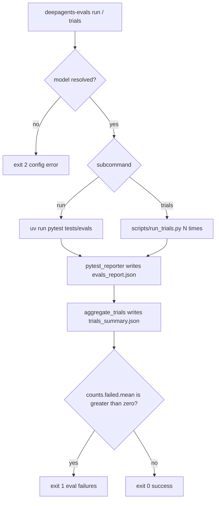

# Workflow: Evaluate & Benchmark Agents

This page is the operator's guide to `libs/evals`, the end-to-end **behavioral
evaluation suite** for the Deep Agents SDK. An eval runs an agent against a real
LLM, captures the full trajectory (tool calls, file mutations, final response),
and scores it on correctness and efficiency. The suite also carries
[Harbor](https://github.com/laude-institute/harbor) integration for running
sandboxed benchmarks such as Terminal-Bench, and a **unified evals** CI battery
that produces one cross-model comparison.

For how the SDK agent under test is assembled, see
[Build a Deep Agent](build-a-deep-agent.md) and the
[Architecture Overview](../architecture/overview.md). Model identifiers
(`provider:model` specs) and how the suite resolves them are covered in
[Profiles & Models](../concepts/profiles-models.md). The unit-test side of the
same package — and how these behavioral evals differ from ordinary tests — is in
the [Testing Guide](../testing/testing-guide.md).

## What the suite measures

Each eval scores the agent's trajectory through a two-tier assertion model
implemented by `TrajectoryScorer`:

- **Success assertions** (`.success(...)`) are correctness checks that
  **hard-fail** the test — e.g. `final_text_contains`, `file_equals`,
  `llm_judge`.
- **Efficiency assertions** (`.expect(...)`) are trajectory-shape expectations
  (expected step count, expected tool calls) that are **logged but never fail**
  the test.

Evals are `@pytest.mark.langsmith` test functions that accept a `model` fixture,
build an agent with `create_deep_agent(...)`, and drive it via `run_agent(...)`.
The catalog of every eval, grouped by category, lives in the auto-generated
[`EVAL_CATALOG.md`](../../libs/evals/EVAL_CATALOG.md) — do not edit it by hand;
it is regenerated from `tests/evals/`.

## Package structure

`libs/evals` is a single package with several cooperating pieces, each owning a
distinct part of the workflow:

| Component | Role |
|---|---|
| `deepagents_evals/` (`cli`, `radar`, `tau3_subset`, `trial_summary`) | The installable `deepagents-evals` console script plus its supporting modules: radar-chart rendering, the curated τ³ conversation subset, and the GHA step-summary table renderer. |
| `deepagents_clbench/` | Version-controlled source of the `deepagents` system for [continual-learning-bench](https://github.com/pgasawa/continual-learning-bench); deployed into a clbench checkout to run. |
| `deepagents_harbor/` | Deepagents-side Harbor integration: LangSmith dataset/experiment/feedback plumbing (`langsmith.py`), trial failure classification (`failure.py`), and the LangGraph agent project the Harbor sandbox installs. |
| `harbor_adapters/` | Harbor adapters for external benchmarks (`contextbench`, `drbench`). |
| `datasets/` | Local benchmark datasets used by the unified battery (`context-retrieval-evals`, `drbench-evals`). |
| `tests/evals/` | The evals themselves plus the framework (`utils.py`, `llm_judge.py`, `conftest.py`, `pytest_reporter.py`) and vendored task data. |

## The `deepagents-evals` CLI

The canonical interface is the `deepagents-evals` console script, registered as
`deepagents_evals.cli:main` in `pyproject.toml`. The `Makefile` targets remain
available for CI parity — the console script is a strict superset that also adds
discovery and JSON output. Subcommands:

| Subcommand | Purpose |
|---|---|
| `run` | Run the eval suite once (single trial). |
| `trials` | Run the suite N times and aggregate metrics. |
| `aggregate` | Aggregate previously-written trial reports. |
| `radar` | Generate a radar chart from results. |
| `catalog` | Regenerate or check `EVAL_CATALOG.md`. |
| `model-groups` | Regenerate or check `MODEL_GROUPS.md`. |
| `list` | Discover categories / tiers / models / evals. |

Most subcommands accept `--json` (machine-readable stdout) and `--dry-run`
(print the underlying invocation without executing).

### Discovery first

Before kicking off a run, ask the CLI what is available rather than grepping
source. `list` reads its answers from data, not by importing the test modules:
categories come from `deepagents_evals/categories.json`, tiers are the fixed
`("baseline", "hillclimb")` set, models come from the registry at
`.github/scripts/evals/models.py`, and evals are discovered with the AST walker
from `scripts/generate_eval_catalog.py` (so `list` needs neither LangSmith
config nor the full eval dependency graph).

```sh
deepagents-evals list categories
deepagents-evals list tiers
deepagents-evals list models --group set0
deepagents-evals list models --provider anthropic
deepagents-evals list evals --category memory
```

### Running

```sh
# Single trial against one model.
deepagents-evals run --model claude-opus-4-7

# Restrict to a category and tier, and write a JSON report.
deepagents-evals run --model openai:gpt-5.5 \
    --eval-category memory --eval-tier baseline --report evals_report.json

# Three trials with stats aggregation.
deepagents-evals trials --model openai:gpt-5.5 --trials 3

# Re-run only the failures from a prior sweep.
deepagents-evals trials --model openai:gpt-5.5 --trials 1 \
    --retry-failed trial_runs/trials_summary.json
```

`run` shells out to `uv run --group test pytest tests/evals` from `libs/evals`,
forwarding `--model` and every category/tier/provider flag through to
`tests/evals/conftest.py`. `trials` delegates to `scripts/run_trials.py`, and
`aggregate` re-runs it in `--aggregate-only` mode over a directory of reports.

`--model` may be omitted when `DEEPAGENTS_EVALS_MODEL` is set — the explicit flag
wins when both are present. If neither resolves, the CLI exits with a
configuration error and lists known model groups in the message.

### Control flow



Caption: How a run or trial sweep resolves the model, executes pytest, and maps
the aggregated summary to an exit code.

### Exit codes

Automation should branch on exit codes, not parse human-readable output:

| Code | Meaning |
|---|---|
| `0` | Success. |
| `1` | Eval failures. For `run`, a non-zero `pytest` exit; for `trials` / `aggregate`, an aggregated summary whose `counts.failed.mean` is greater than zero; `radar` failures also map here. |
| `2` | Configuration error: missing `--model`, model-registry import failure, `argparse` usage error, or a `--check` drift detector finding a stale generated file. |
| `3` | No usable reports: `trials` / `aggregate` produced no summary, or `--retry-failed` could not parse any prior reports. |

The critical subtlety: the `pytest_reporter` plugin rewrites pytest's session
exit status to `0` even when individual evals fail, so the per-trial
`pytest_returncode` is **not** a reliable failure signal. The CLI decides
failure from the aggregated `counts.failed.mean` in `trials_summary.json`
instead.

## Makefile parity

`make evals MODEL=...` and `make evals-trials MODEL=... TRIALS=...` still work and
remain the form CI invokes. `make evals` runs
`LANGSMITH_TEST_SUITE=deepagents-evals uv run --group test pytest tests/evals`
with the given model; `make evals-trials` calls `scripts/run_trials.py`. Both
targets fail fast with a usage message when `MODEL` (or `TRIALS`) is unset. The
console script exposes every flag the Makefile passes through to pytest, plus
discovery and `--json` output the Makefile cannot offer.

## Model groups

Available `provider:model` specs are curated into named **model groups**
(`set0`, `set1`, `frontier`, `fast`, `open`, `docs`, ...) plus per-provider
groups. The source of truth is `.github/scripts/evals/models.py`; the
human-readable [`MODEL_GROUPS.md`](../../libs/evals/MODEL_GROUPS.md) is
auto-generated from it. `deepagents-evals model-groups --check` and
`catalog --check` are drift detectors: a non-zero exit means the generated file
is stale (mapped to exit code `2`), not that evals failed. Use
`deepagents-evals list models --group <name>` to enumerate a group without
opening the file. Model specs and resolution are documented in
[Profiles & Models](../concepts/profiles-models.md).

## Required environment

The suite refuses to start without LangSmith tracing — `conftest.py` aborts if
`LANGSMITH_TRACING=true` and `LANGSMITH_API_KEY` are not set, because every eval
uses `langsmith.testing` to log inputs, outputs, and feedback that powers the
report summary and cross-model comparisons:

```sh
export LANGSMITH_TRACING=true
export LANGSMITH_API_KEY=...
```

You also need the provider key matching the chosen `--model` (any of
`OPENAI_API_KEY`, `ANTHROPIC_API_KEY`, ...). Results are logged to LangSmith
under the `deepagents-evals` test suite; `--evals-report-file <path>` (or
`DEEPAGENTS_EVALS_REPORT_FILE`) additionally writes a JSON summary.

## Trials, aggregation, and retry

`deepagents-evals trials` runs the suite N times and writes two artifact kinds:
per-trial `evals_report_trial_NNN.json` files (each carrying metrics and a
`failures` array) and an aggregated `trials_summary.json` with mean / median /
stdev / min / max for correctness, solve rate, step ratio, tool-call ratio,
duration, pass/fail counts, and per-category scores. `--summary-out` wins for the
summary location; otherwise it lands next to the per-trial reports under
`--out-dir` (default `trial_runs/`).

`--retry-failed` accepts either a `trials_summary.json` file or a directory of
per-trial reports, reads the `failures[].test_name` node IDs, dedupes them across
trials (so a flake that failed once is retried once), and passes only those node
IDs to a fresh trial run. If reports are found but none parse, the CLI exits `3`
and prints how many it discovered.

## Harbor & unified evals

Beyond the pytest suite, the package integrates Harbor for sandboxed benchmarks.
The `deepagents_harbor/langgraph_project/langgraph.json` file is the source of
truth for the packages the Harbor agent env installs; `deepagents_harbor` also
owns the LangSmith dataset/experiment/feedback plumbing and classifies each trial
failure as **infrastructure** (OOM, timeout, sandbox) versus **model
capability** via `FailureCategory`, so infra flakes are not read as model
regressions. Makefile targets such as `make run-hello-world` and
`make run-terminal-bench-*` drive Harbor across sandbox backends (Docker, Modal,
Daytona, Runloop, LangSmith), after `make stage-harbor-local-deps` stages
checked-out packages for the sandbox install.

The **unified evals** workflow
(`.github/workflows/unified_evals.yml`) runs one or more models through a fixed
battery split into capability axes — **autonomous** (Harbor-index), **conversation**
(τ³-bench subset), **context** (Context-Bench), and **research** (DRBench) — and
produces one cross-model comparison: a leaderboard plus (when at least three axes
run) a radar chart. The conversation axis is bound to the `tau3` runtime because
it hosts a **user simulator** the agent must converse with; the other axes run
either the neutral `bare` `create_deep_agent` or the `dcode` product agent. Each
axis reports `pass@K` (fraction of tasks passing in at least one of K rollouts)
except graded axes like `research`, which report `avg@K`. The design rationale —
which benchmark stands in for each capability and why — is documented in
[`UNIFIED_EVALS.md`](../../libs/evals/UNIFIED_EVALS.md), the authoritative
companion to `EVAL_CATALOG.md`.

Published cross-model results are collected in
[`UNIFIED_SCORECARD.md`](../../libs/evals/UNIFIED_SCORECARD.md), which reports
per-model `pass@k` / `avg@k` by category for both the full profile and a frozen
high-signal **lite** subset.
