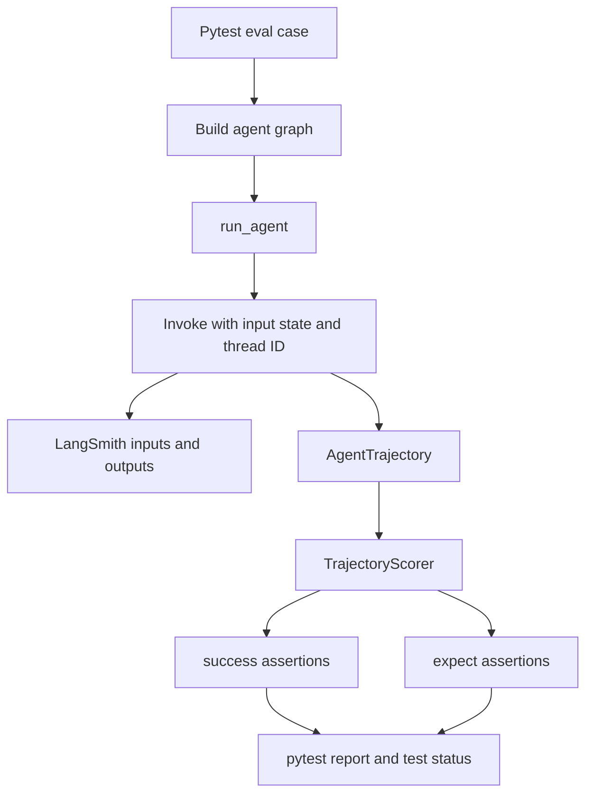
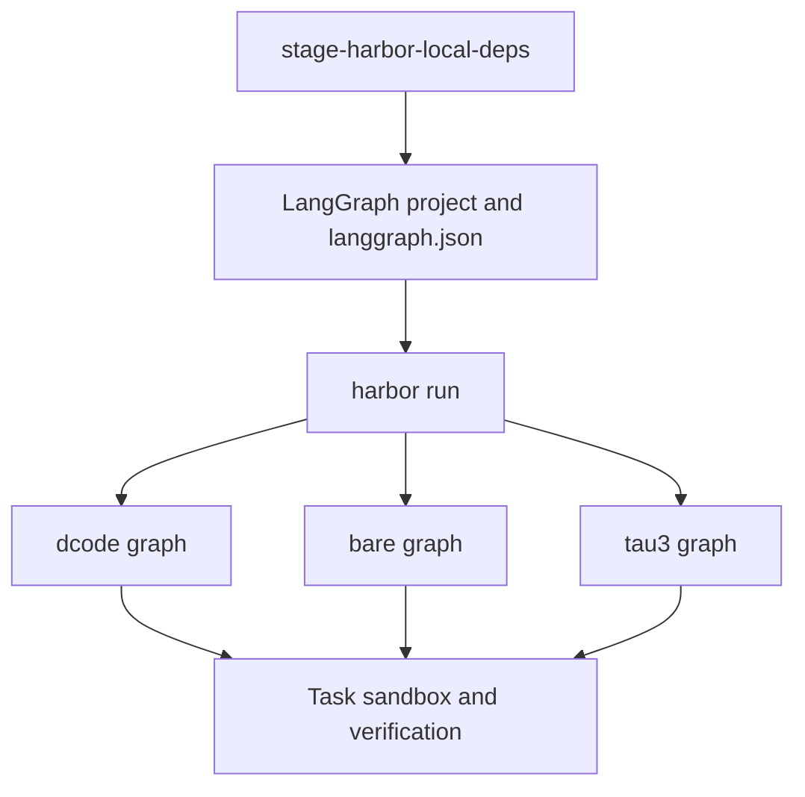

# Run Evals and Harbor Workloads

`libs/evals` is the real-model behavioral evaluation suite for Deep Agents. A case runs an agent against an LLM, captures its tool calls, file mutations, and final response as a trajectory, then scores correctness and efficiency. This is deliberately separate from the deterministic harness tests: use unit tests to validate evaluator and adapter mechanics, and use these evals to assess model-dependent agent behavior.

Related guidance: [architecture overview](../architecture/overview.md), [sandbox partners](../integrations/sandbox-partners.md), [development](../operations/development.md), and the [testing guide](../testing/testing-guide.md).

## Select an entry point

| Need | Entry point | Result |
| --- | --- | --- |
| Validate evaluator, reporter, CLI, or Harbor-adapter mechanics offline | `make test` | Runs `tests/unit_tests` with network sockets disabled except Unix sockets. |
| Inspect available filters without importing real-model test modules | `deepagents-evals list …` | Categories, tiers, registered models, or AST-discovered evals. |
| Run a selected model once | `deepagents-evals run` | One traced pytest execution, optionally with a JSON report. |
| Measure rollout variability | `deepagents-evals trials` | Sequential trials plus an aggregate summary. |
| Combine reports from separate CI jobs | `deepagents-evals aggregate DIR` | A merged `trials_summary.json`. |
| Run task-owned verification in a sandbox | Harbor Make targets | A Harbor job using a configured LangGraph agent and sandbox backend. |

From `libs/evals`, synchronize the environment and run a focused deterministic check with:

```sh
uv sync --all-groups
make test TEST_FILE=tests/unit_tests/test_harbor_langgraph_agent.py
```

`make evals` is not a substitute for that test target: it invokes `pytest tests/evals` against a real model.

## Discover, configure, and run behavioral evals

The installed `deepagents-evals` console script is the canonical operator interface. Its subcommands are `run`, `trials`, `aggregate`, `radar`, `catalog`, `model-groups`, and `list`. Use its help and data-driven discovery before choosing a model or filter:

```sh
cd libs/evals
deepagents-evals list categories
deepagents-evals list tiers
deepagents-evals list models --group set0
deepagents-evals list evals --category memory
deepagents-evals run --dry-run --model claude-sonnet-4-6 --eval-category memory
```

`list` does not import the test modules: categories come from `deepagents_evals/categories.json`, tiers are `baseline` and `hillclimb`, model data is loaded from the repository registry, and evals are found by the catalog generator's AST walker. This makes discovery safe before the tracing and provider configuration needed by a live test exists.

A live eval requires LangSmith tracing to be enabled, a valid LangSmith configuration, and credentials appropriate for the selected provider. The eval `conftest.py` stops the session before collection when tracing is not enabled or pytest has no model. Do not put credentials in commands, checked-in files, reports, or shell history. The CLI accepts `--model`; alternatively `DEEPAGENTS_EVALS_MODEL` supplies the default, while an explicit flag wins.

```sh
# A single traced run with a report and narrow, repeatable filters.
deepagents-evals run \
  --model claude-sonnet-4-6 \
  --eval-category memory \
  --eval-tier baseline \
  --report evals_report.json

# Forward a focused pytest selector after -- when necessary.
deepagents-evals run --model claude-sonnet-4-6 -- tests/evals/test_memory.py
```

`run` executes `uv run --group test pytest tests/evals` from `libs/evals`, forwarding category, tier, provider-routing, reasoning, REPL, report, and trailing pytest arguments. Category and tier flags are repeatable. An exclusion wins if a category is both included and excluded; unknown selected values abort collection rather than silently running a different set. For provider comparability, `--openrouter-provider` pins the provider list by default and `--openrouter-allow-fallbacks` explicitly permits fallback. `--openai-reasoning-effort` is constrained to its supported values, and `--repl` currently accepts `quickjs`.

Most operator subcommands support `--json` for machine-readable stdout and `--dry-run` to display the underlying invocation. In automation, consume those structured interfaces and the process exit code rather than parsing display text.

### What a behavioral eval records

A normal eval is a `@pytest.mark.langsmith` test that accepts the model fixture, builds an agent—usually with `create_deep_agent(...)`—and passes it with a `TrajectoryScorer` to `run_agent(...)`. The helper builds input state from the query, optional initial files, and extra state; invokes the compiled graph with a thread ID; logs inputs and outputs to LangSmith; converts the mapping result to an `AgentTrajectory`; then applies the scorer.



Caption: a traced graph invocation becomes a trajectory; correctness gates test status while efficiency remains diagnostic.

The scorer has two intentional assertion tiers:

- `TrajectoryScorer.success(...)` is a correctness assertion and hard-fails the test.
- `TrajectoryScorer.expect(...)` records a trajectory-shape or efficiency expectation but never fails the test.

Keep alternate valid agent strategies valid: use a hard assertion only for an outcome required by the task; use expectations for steps, tool-call shape, or other diagnostics.

## Repeat trials and interpret reports

A single rollout is useful for debugging but weak evidence for a model-sensitive comparison. Run the same model and filters repeatedly:

```sh
deepagents-evals trials \
  --model claude-sonnet-4-6 \
  --trials 3 \
  --eval-category memory \
  --out-dir trial_runs/memory

# Merge artifact bundles produced by separate jobs.
deepagents-evals aggregate trial_runs/memory --summary-out trial_runs/memory/summary.json

# Retry each node ID that failed in any prior report once.
deepagents-evals trials \
  --model claude-sonnet-4-6 \
  --trials 1 \
  --retry-failed trial_runs/memory/trials_summary.json
```

Within one invocation, trials are intentionally sequential: concurrent in-process LangSmith experiment creation and provider rate limits are unsafe. CI parallelizes separate jobs instead, then uses aggregate-only processing to merge their reports. The direct script accepts the same model environment default and supports `--aggregate-only`; the CLI is preferred because it normalizes outcome semantics.

Each live trial writes `evals_report_trial_NNN.json`; aggregation writes `trials_summary.json`. The summary includes mean, median, sample standard deviation, minimum, and maximum for correctness, solve rate, step and tool-call ratios, duration, pass/fail/skip/total counts, and category scores. A metric has its own sample count: null values are skipped, non-numeric values are excluded with a warning, and standard deviation is null with fewer than two samples. It also preserves concise per-trial metadata such as model, SDK version, report counts, experiment URLs, and any observed pytest return code. A mixed model or SDK version emits a warning; do not use such a merged summary for a regression conclusion.

`--retry-failed` accepts either a summary file or a directory. It recursively reads per-trial reports, extracts `failures[].test_name`, deduplicates node IDs across trials, and reruns each failed test once. It returns the no-usable-reports outcome if it finds no failed IDs, including the case where discovered reports cannot be parsed.

### Exit codes are part of the contract

| Code | Meaning | Automation action |
| --- | --- | --- |
| `0` | Successful command or a summary with no failed tests. | Continue. |
| `1` | A single run's pytest failed; a trials or aggregate summary has `counts.failed.mean > 0`; or radar generation failed. | Treat as eval failure. |
| `2` | CLI usage/configuration problem, model-registry failure, missing model, or stale generated output detected by `--check`. | Fix configuration or regenerate artifacts. |
| `3` | Trials/aggregation yielded no usable reports, or retry could not obtain usable failures. | Repair report production or input artifacts. |

The pytest reporter may rewrite pytest's session exit status to `0` even when individual evals fail. Therefore, for `trials` and `aggregate`, `counts.failed.mean` in `trials_summary.json`—not `pytest_returncode`—is the authoritative failure signal. A nonzero pytest return code remains diagnostic in an individual trial, especially if a teardown fails after a report was written.

## Maintain eval metadata and CI-compatible targets

`EVAL_CATALOG.md` is generated from AST-visible functions under `tests/evals/`; do not edit it by hand. `MODEL_GROUPS.md` is generated from the model registry. After changes that affect either generated document, regenerate and check them:

```sh
make eval-catalog
make model-groups
deepagents-evals catalog --check
deepagents-evals model-groups --check
```

A failing `catalog --check` or `model-groups --check` maps to exit code `2`, not an eval failure. The regular lint target also checks catalog drift. Categories and labels are centralized in `categories.json`; only capability-facing categories belong in `radar_categories`, which deliberately excludes `unit_test` and `langchain/middleware`.

The Makefile remains the CI-compatible interface for common execution:

```sh
make evals MODEL=claude-sonnet-4-6
make evals-trials MODEL=claude-sonnet-4-6 TRIALS=3 TRIAL_ARGS="--eval-category memory"
```

These targets fail fast when their required variables are missing. The console CLI is the broader interface, adding discovery, structured output, dry-run support, aggregation, and first-class filtering.

## Stage and run Harbor workloads

Harbor is a separate execution boundary: it runs the agent inside task sandboxes and applies benchmark-owned verification. Before local Harbor runs, `stage-harbor-local-deps` copies checked-out `deepagents`, `deepagents-code`, ACP, and QuickJS sources into `deepagents_harbor/langgraph_project/.local_deps`. This is necessary because the sandbox installs from the LangGraph project's `langgraph.json`, whose dependencies and graph mapping are the source of truth for the agent environment.

```sh
cd libs/evals
make stage-harbor-local-deps
make run-hello-world MODEL=anthropic:claude-sonnet-4-6
make run-terminal-bench-docker MODEL=anthropic:claude-sonnet-4-6
```

The targets stage dependencies automatically as a prerequisite. `run-hello-world` uses Docker and one slot. Terminal Bench targets select Docker (one concurrent trial), Modal (four), Daytona (40), Runloop (10), or LangSmith sandboxes (one); `-n` is the number of concurrent sandbox trials, not a task limit. The default graph selection is `dcode`, but set `HARBOR_AGENT_IMPL` to choose another declared graph.



Caption: Harbor installs the staged LangGraph project, selects one configured graph, and runs it under task-owned sandbox verification.

The graphs have distinct responsibility boundaries:

- `dcode` calls Deep Agents Code's headless CLI constructor with shell enabled, automatic approval, memory/skills/user questions disabled, and the sandbox working directory. It preserves the production dcode system prompt rather than injecting an eval prompt. It normalizes Harbor session IDs into bounded filesystem-safe assistant IDs, including a hash when normalization or truncation could collide.
- `bare` directly calls `create_deep_agent` with a `LocalShellBackend` rooted at the task working directory, `inherit_env=False`, and `virtual_mode=False`. It is the prompt-free SDK baseline for filesystem and shell tasks.
- `tau3` creates a conversational SDK graph from MCP tools forwarded in `configurable.mcp_servers`. It accepts only remote HTTP/SSE transports and rejects `stdio`, so dataset-provided command/argument fields cannot execute arbitrary commands in the agent sandbox. Missing forwarded MCP servers is an explicit configuration error.

The dcode graph removes provider and LangSmith variables from the process while the shell-backed agent is constructed, then restores them. Preserve that scope: it prevents task shell operations from inheriting credentials. Optional Tavily-backed `web_search` is offered only when its environment is available; its result count and rendered payload are bounded, failed searches return tool text rather than aborting a long research run, and the key is never returned in tool output.

Finally, classify Harbor failures before reading them as model regressions. `FailureCategory` distinguishes model `CAPABILITY` failures from `INFRA_OOM` (exit 137), `INFRA_TIMEOUT` (exit 124), and `INFRA_SANDBOX`; `UNKNOWN` is retained when evidence is insufficient. Exit-code extraction prefers ATIF observation/tool output over model text, reducing false positives. Rerun or repair infrastructure failures, and compare only equivalent task sets, graph implementation, sandbox backend, model parameters, and dependency stage.

## Focused verification when changing this workflow

- Run `make test TEST_FILE=tests/unit_tests/test_harbor_langgraph_agent.py` after changing Harbor graph construction, session identity, web search, or MCP safety. The tests verify the real graph mapping, no-secret construction scope, bounded search behavior, model defaults, local-shell settings, and `stdio` rejection.
- Run catalog and model-group checks after changing eval declarations or model registry data.
- Start real-model changes with a narrow category and report, inspect the LangSmith trajectory and JSON report, then use repeated trials before making a comparison claim.
- Stage local dependencies before every local Harbor validation so the sandbox exercises the checkout rather than an incidental installed package.
