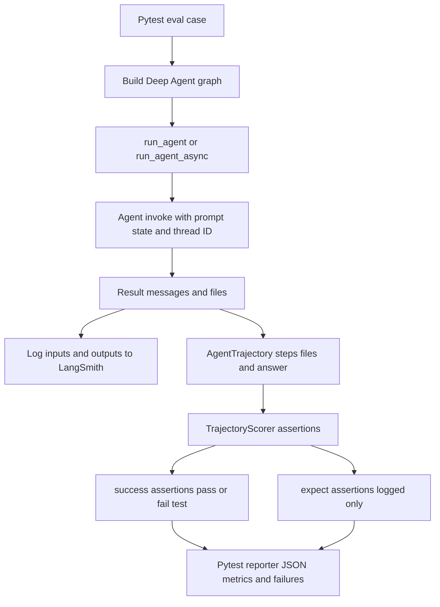

# Run and Extend Evaluations

`libs/evals` contains the real-model behavioral evaluation suite for the Deep Agents SDK. An eval runs an agent against an LLM, retains its tool calls, file mutations, and final response as a trajectory, then scores correctness and efficiency. This is distinct from the deterministic package suite: use deterministic tests to validate harness mechanics, and use real-model evaluations to make a claim about agent behavior or model quality.

Related guidance: [SDK construction and execution](../architecture/sdk-construction-execution.md), [tools and filesystem](../concepts/tools-filesystem.md), [development](../operations/development.md), and the [testing guide](../testing/testing-guide.md).

## Choose the right boundary

| Question | Entry point | What it establishes |
| --- | --- | --- |
| Did a deterministic CLI, catalog, reporter, or adapter change work? | `make test` | Offline unit-test behavior. The default target runs `tests/unit_tests` with network sockets disabled, except Unix sockets. |
| Did an SDK behavior work with a selected real model? | `deepagents-evals run` | One traced behavioral rollout per selected eval. |
| Is a model-sensitive result stable? | `deepagents-evals trials` | Variation and aggregate metrics across repeated rollouts. |
| Can an agent finish external sandbox tasks? | Harbor commands | Sandbox task execution and task-owned verification. |
| How do several models compare across external capability axes? | `unified_evals.yml` | A fixed cross-model benchmark comparison. |

From `libs/evals`, start deterministic work with:

```sh
uv sync --all-groups
make test TEST_FILE=tests/unit_tests/
# For a focused harness change:
make test TEST_FILE=tests/unit_tests/test_eval_catalog.py
```

Do not use `make evals` as a replacement for the unit suite: it invokes real models and LangSmith.

## Behavioral eval lifecycle

Every normal eval is a `@pytest.mark.langsmith` test. It receives the `model` fixture, normally builds a graph with `create_deep_agent(...)`, and invokes `run_agent(...)` or `run_agent_async(...)` with a `TrajectoryScorer`. `run_agent` seeds optional files and extra state, supplies a thread ID, logs compact inputs and the raw result to LangSmith, turns the graph result into an `AgentTrajectory`, and applies the scorer.



Caption: the behavioral suite derives a scored trajectory from a traced graph invocation; correctness controls test status, while efficiency remains diagnostic.

### Scoring contract

The scorer deliberately separates two kinds of evidence:

- `TrajectoryScorer.success(...)` contains correctness assertions and hard-fails a test when one fails. Available checks include final-answer text, file state, and LLM judging.
- `TrajectoryScorer.expect(...)` captures expected trajectory shape—such as agent steps, tool-call requests, or tool calls—and logs deviations without failing the test.

This preserves alternate valid approaches: do not turn a soft expectation into a hard gate unless the specific trajectory is actually required. For example, the incident-graph evals pair answer assertions with expected multi-step tool chains; they can run direct tools or, only for marked cases, route tools through the `quickjs` REPL.

## Prepare and run a behavioral suite

The eval `conftest.py` aborts before collection unless LangSmith tracing is enabled and `--model` is supplied. Set a LangSmith API key and credentials for the chosen model provider; `LANGSMITH_TRACING=true` is the conventional tracing flag.

```sh
cd libs/evals
uv sync --all-groups
export LANGSMITH_TRACING=true
export LANGSMITH_API_KEY=...
export ANTHROPIC_API_KEY=...

# Discover without importing test modules.
deepagents-evals list categories
deepagents-evals list tiers
deepagents-evals list models --group set0
deepagents-evals list evals --category tool_use

# Start narrow, then expand.
deepagents-evals run --model claude-opus-4-7 \
  --eval-category tool_use --eval-tier baseline --report evals_report.json
```

`deepagents-evals` is the primary operator interface. Its `run`, `trials`, `aggregate`, `radar`, `catalog`, `model-groups`, and `list` subcommands provide discovery, execution, generated-document maintenance, and reporting. `run` shells out from `libs/evals` to `uv run --group test pytest tests/evals`, passing model, category, tier, provider-routing, reasoning, REPL, report, and extra pytest options through to pytest.

For `run` and `trials`, `--model` takes precedence over `DEEPAGENTS_EVALS_MODEL`; the environment variable is a convenient default. The pytest collector validates requested categories and tiers against collected tests, and a category exclusion wins over its inclusion. `--openrouter-provider` requires an `openrouter:` model and is strict by default; `--openrouter-allow-fallbacks` explicitly relaxes that pin. OpenAI reasoning effort requires an `openai:` model.

The Makefile is retained for CI-compatible invocation:

```sh
make evals MODEL=claude-opus-4-7
make evals-trials MODEL=openai:gpt-5.5 TRIALS=3 \
  TRIAL_ARGS="--eval-category memory"
```

Both required Makefile variables fail fast when missing. Prefer `deepagents-evals --help` and subcommand help for the complete interactive interface; most subcommands support `--json` and `--dry-run` for automation and safe preview.

## Catalog, categories, tiers, and model groups

`EVAL_CATALOG.md` is generated from the AST-visible eval functions in `tests/evals/`, grouped by their category; never edit it manually. The unit test runs the generator in `--check` mode, so an added, removed, renamed, or retagged eval must be followed by:

```sh
make eval-catalog
make test TEST_FILE=tests/unit_tests/test_eval_catalog.py
```

Categories are declared in `deepagents_evals/categories.json`. It supplies the complete category list and labels for filtering, radar generation, CI aggregation, and tests; its `radar_categories` list intentionally excludes SDK-plumbing categories. The fixed tiers are `baseline` for regression gates and `hillclimb` for progress tracking.

To add a capability category:

1. Add its machine name and label to `categories`; add it to `radar_categories` only when it measures model capability.
2. Mark each applicable test or module with `pytest.mark.eval_category("name")` and give the eval an appropriate `eval_tier`.
3. Update `EXPECTED_CATEGORY_MODULES` in `tests/unit_tests/test_category_tagging.py`.
4. Regenerate the catalog and run the deterministic checks.

`deepagents-evals list` avoids importing model-costing tests: it reads categories from JSON, uses fixed tier values, lazily loads eval-tagged models from `.github/scripts/evals/models.py`, and asks the catalog generator's AST walker for evals. The model registry defines named groups such as `set0`, `set1`, `frontier`, `fast`, `open`, `docs`, and provider groups; `MODEL_GROUPS.md` is generated from that registry. Use `deepagents-evals catalog --check` and `deepagents-evals model-groups --check` in maintenance or CI to detect stale generated files.

## Multi-trial interpretation and automation

One rollout is a diagnostic, not a stable comparison. Run repeated trials with identical model and configuration:

```sh
deepagents-evals trials --model openai:gpt-5.5 --trials 3 \
  --eval-category memory --out-dir trial_runs/memory

# Merge reports downloaded from separate CI jobs.
deepagents-evals aggregate trial_runs/memory

# Retry every failed test node ID at most once.
deepagents-evals trials --model openai:gpt-5.5 --trials 1 \
  --retry-failed trial_runs/memory/trials_summary.json
```

A local `run_trials` invocation is sequential: concurrent in-process creation of LangSmith experiments and provider rate limits are unsafe. CI can instead run trials in separate jobs and use aggregate-only mode to merge artifacts. A sweep produces `evals_report_trial_NNN.json` reports and `trials_summary.json`, aggregating mean, median, sample standard deviation, minimum, and maximum for correctness, solve rate, step/tool-call ratios, duration, pass/fail counts, and per-category scores. Null metrics are omitted from that metric's sample count; non-numeric values are excluded with a warning. Mixed model or SDK versions similarly warn and should not be used for a regression conclusion.

`--retry-failed` reads `failures[].test_name` from reports found under a summary's directory or an explicit directory, deduplicates node IDs, and returns no-reports status when nothing usable can be retried. The reporter deliberately resets pytest's session status after test calls, so trial and aggregate automation must use `trials_summary.json` `counts.failed.mean`, rather than `pytest_returncode`, to decide whether tests failed.

| Exit code | Meaning |
| --- | --- |
| `0` | Success. |
| `1` | Eval failure, including a nonzero aggregated failed mean; also a failed radar command. |
| `2` | Configuration, usage, model-registry, or generated-file drift error. |
| `3` | No usable reports or no parseable reports for retry. |

## Harbor adapters and sandbox benchmarks

Harbor is a separate execution boundary: it runs the Deep Agent in benchmark task sandboxes and records task results and trajectories. `deepagents_harbor` owns the Deep Agents integration, including LangSmith dataset/experiment/feedback support and failure classification. Its `langgraph_project/langgraph.json` is the installed sandbox environment's dependency source of truth and exports `bare`, `dcode`, and `tau3` graphs.

Before a local Harbor run, stage repository packages for installation into the sandbox:

```sh
cd libs/evals
make stage-harbor-local-deps
make run-hello-world MODEL=anthropic:claude-opus-4-8
make run-terminal-bench-docker MODEL=anthropic:claude-opus-4-8
```

The staging target copies the checked-out Deep Agents, deepagents-code, ACP, and QuickJS packages into `.local_deps`; the supplied Terminal Bench targets select Docker, Modal, Daytona, Runloop, or LangSmith sandbox backends. The Harbor LangGraph agent temporarily removes provider and LangSmith credentials while it performs shell operations and restores them afterward. Keep that scrub boundary intact so task commands cannot inherit secrets.

Interpret a failed Harbor trial before treating it as model evidence. `FailureCategory` distinguishes capability failures from `INFRA_OOM` (exit 137), `INFRA_TIMEOUT` (exit 124), and `INFRA_SANDBOX` based on structured tool output and exception patterns; ambiguous exceptions are `UNKNOWN`. Rerun or repair infrastructure failures rather than reporting them as a behavioral regression.

`harbor_adapters` supplies benchmark-specific bridges such as ContextBench and DRBench. `deepagents_clbench` is separate again: it is the version-controlled Deep Agents system payload for continual-learning-bench, but must be deployed into a clbench checkout because clbench discovers systems from its own `src/systems` tree.

## Unified cross-model battery

The dispatchable `unified_evals.yml` workflow evaluates one or more `provider:model` specs against a fixed external battery, applying the same tasks and scoring to each model. Its capability mapping is:

| Axis | Benchmark | Agent runtime |
| --- | --- | --- |
| Autonomous | `harbor-index` | `bare` or `dcode` |
| Conversation | `tau3-subset` | `tau3` |
| Context | `context-retrieval` | `bare` or `dcode` |
| Research | `drbench` | `bare` or `dcode` |

The conversation axis is necessarily bound to `tau3`, because its runtime hosts the simulated user and multi-turn protocol. The other axes can use the neutral `create_deep_agent` graph or the dcode product agent. Each axis normally reports pass@K—the fraction of tasks that pass at least once among K rollouts. A graded axis such as research reports avg@K instead because its pass@K is structurally zero. The workflow produces a leaderboard and produces a radar chart once at least three axes run; published full and frozen lite-profile results are recorded in `UNIFIED_SCORECARD.md`.

Dispatch the workflow from GitHub Actions or with `gh workflow run unified_evals.yml`. Required `models` is a comma-separated model list; useful controls include categories, `agent_impl`, rollouts, concurrency, sharding, sandbox environment, and a task inclusion filter. Keep model, agent implementation, tasks, rollout count, judge, and sandbox configuration constant for a before/after comparison.

## Safe extension loop

1. State the observable agent behavior and add or run focused deterministic coverage for the harness or adapter mechanics.
2. Add a narrow real-model eval with a stable scenario, category and tier markers, hard correctness assertions, and only diagnostic efficiency expectations.
3. Regenerate `EVAL_CATALOG.md`; update category metadata and tagging tests if the capability taxonomy changed.
4. Run the focused eval with tracing, inspect the LangSmith trajectory and reporter output, then use multiple trials before claiming a model-sensitive delta.
5. For Harbor or unified work, stage the correct agent dependencies, keep execution and judge configuration fixed, and classify infrastructure failures before comparing scores.
6. Use broader behavioral categories or the unified battery only after the focused signal is healthy; retain reports, model/SDK versions, and configuration with the comparison.
