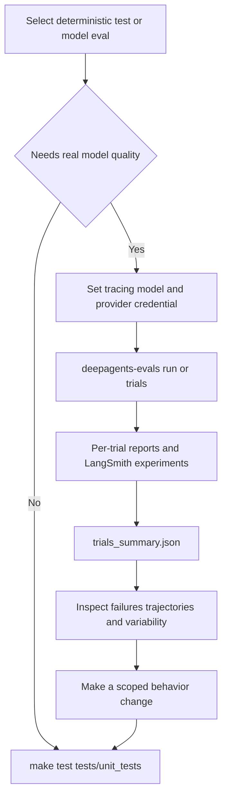

# Workflow: Evaluate & Benchmark Agents

Use the smallest evaluation boundary that answers the question. `libs/evals` contains both deterministic package tests and an end-to-end behavioral suite: the latter runs an agent against a real LLM, captures tool calls, file mutations, and final response, and scores correctness and efficiency. It also contains Harbor integration for sandboxed benchmarks such as Terminal Bench.

- For a code or harness change, start with the socket-blocked `tests/unit_tests/` command below.
- For a known SDK behavior whose quality depends on a model, use the traced `tests/evals/` suite and preferably multiple trials.
- For end-to-end task completion in an external sandbox, use Harbor or dispatch the unified benchmark battery.

This distinction is important: neither a passing unit suite nor a single model rollout establishes a behavioral or benchmark regression. See the [Testing Guide](../testing/testing-guide.md) for test-boundary conventions, [development operations](../operations/development.md) for package setup, and [Build a Deep Agent](build-a-deep-agent.md) for the agent being evaluated.

## 1. Deterministic package validation — no model or network prerequisites

From `libs/evals`, sync the package and run the focused offline suite. Its normal `test` target runs `tests/unit_tests` with `--disable-socket` (while allowing Unix sockets), so it is the right first gate for CLI, reporting, aggregation, Harbor adapter, and other deterministic changes.

```sh
cd libs/evals
uv sync --all-groups
make test TEST_FILE=tests/unit_tests/

# Focus a changed harness component.
make test TEST_FILE=tests/unit_tests/test_cli.py
make test TEST_FILE=tests/unit_tests/test_run_trials.py
```

Do **not** substitute `make evals` for these tests: it calls real models and LangSmith. Keep a deterministic assertion for a change's mechanics; add or run a real-model evaluation only when the claimed behavior involves model choices or trajectory quality. `make dataset-check` is also a deterministic maintenance check for DRBench dataset pins and repeatable generation.

## 2. Real-model behavioral evals — credentials, tracing, and cost required

The `tests/evals/` suite is intentionally networked and model-costing. Before running it, choose a model and export tracing plus the selected provider's credential. The suite aborts early if tracing is not enabled or `--model` is absent; its documented required setup uses `LANGSMITH_TRACING=true` and `LANGSMITH_API_KEY`. The provider key (for example, `ANTHROPIC_API_KEY` or `OPENAI_API_KEY`) must also be available for the selected model.

```sh
cd libs/evals
uv sync --all-groups
export LANGSMITH_TRACING=true
export LANGSMITH_API_KEY=...
export ANTHROPIC_API_KEY=...

# Inspect without importing or collecting model tests.
deepagents-evals list categories
deepagents-evals list tiers
deepagents-evals list models --group set0
deepagents-evals list evals --category memory

# Run the narrow behavior first, then the relevant battery.
deepagents-evals run --model claude-opus-4-7 --eval-category memory --eval-tier baseline
```

`EVAL_CATALOG.md` is the generated inventory of categories and evals: it is generated from `tests/evals/` by `scripts/generate_eval_catalog.py` and must not be hand-edited. Each eval is a `@pytest.mark.langsmith` test that accepts a model fixture, constructs an agent with `create_deep_agent(...)`, and invokes it through `run_agent(...)` with a `TrajectoryScorer`.

### What a behavioral eval proves

The scorer has two deliberately different assertion tiers:

- `TrajectoryScorer.success(...)` assertions are correctness requirements and fail the test.
- `TrajectoryScorer.expect(...)` assertions describe trajectory efficiency, such as expected steps or tool calls; they are recorded but never fail the test.

Treat a correctness failure as an actionable behavior regression. Treat an efficiency change as a diagnostic signal: inspect the captured trajectory and LangSmith experiment before converting it into a hard requirement. This prevents a harmless alternate tool sequence from being treated as a correctness failure.

### Operator interface and selection

`deepagents-evals`, registered as `deepagents_evals.cli:main`, is the canonical interface. Its subcommands are `run`, `trials`, `aggregate`, `radar`, `catalog`, `model-groups`, and `list`; most accept `--json` for structured stdout and `--dry-run` to print the invocation instead of running it.

`list` is safe for discovery: categories come from `deepagents_evals/categories.json`, tiers are `baseline` and `hillclimb`, model data is loaded from `.github/scripts/evals/models.py`, and evals are found through the catalog generator's AST walker rather than by importing test modules. Model specs are curated into groups such as `set0`, `set1`, `frontier`, `fast`, `open`, and `docs`, as well as provider groups. The registry is authoritative; `MODEL_GROUPS.md` is generated from it.

For `run` and `trials`, an explicit `--model` overrides `DEEPAGENTS_EVALS_MODEL`; the environment value supplies the model only when the flag is absent. Category/tier filters are passed to pytest. At collection, an unknown requested category or tier exits the session, and an exclusion takes precedence over an inclusion.

```sh
# One run and a durable local report.
deepagents-evals run --model openai:gpt-5.5 \
  --eval-category memory --eval-tier baseline --report evals_report.json

# Preview an expensive command.
deepagents-evals run --model openai:gpt-5.5 --eval-category memory --dry-run

# CI-compatible alternatives.
make evals MODEL=claude-opus-4-7
make evals-trials MODEL=openai:gpt-5.5 TRIALS=3
```

`run` executes `uv run --group test pytest tests/evals` from `libs/evals`, forwarding the model and supported category, tier, provider, reasoning, and REPL options. The Makefile forms remain CI entrypoints, require their `MODEL` (and, for trials, `TRIALS`) variables, and mirror a subset of the console script's flags. `catalog --check` and `model-groups --check` detect stale generated documentation; their non-zero result is configuration/drift (exit `2`), not an evaluation failure.

## 3. Trials: make a decision from aggregates, not one rollout

Run several sequential trials for a behavior change or a model comparison. A single invocation is deliberately sequential because concurrent in-process trials are unsafe with LangSmith experiment creation and provider rate limits; CI can parallelize separate jobs and aggregate their reports afterward.

```sh
deepagents-evals trials --model openai:gpt-5.5 --trials 3 \
  --eval-category memory --out-dir trial_runs/memory

# Aggregate reports made by separate jobs.
deepagents-evals aggregate trial_runs/memory

# Retry each failed node ID only once across a previous sweep.
deepagents-evals trials --model openai:gpt-5.5 --trials 1 \
  --retry-failed trial_runs/memory/trials_summary.json
```

A trial writes `evals_report_trial_NNN.json`, including metrics and failure details. Aggregation writes `trials_summary.json`, with mean, median, sample standard deviation, minimum, and maximum for correctness, solve rate, step/tool-call ratios, duration, pass/fail counts, and category scores. It warns if reports mix model or SDK versions: do not use such a combined result as a regression comparison.



Caption: deterministic tests protect implementation mechanics; traced trials provide the evidence for a model-sensitive behavioral decision.

A reporting subtlety matters for automation: `pytest_reporter` rewrites pytest's session exit status to `0` after test calls so reporting completes, even when individual evals fail. Therefore, do not infer a trial sweep's result from `pytest_returncode`; the CLI reads aggregated `counts.failed.mean` from `trials_summary.json`.

| Exit code | Meaning |
| --- | --- |
| `0` | Success. |
| `1` | Eval failure: a single run's pytest failure, a trial/aggregate summary with nonzero failed mean, or radar generation failure. |
| `2` | Configuration or usage error, including missing model, registry-load failure, argparse error, or stale generated output detected by `--check`. |
| `3` | No usable reports to aggregate or no parsable report from which to retry failures. |

`--retry-failed` accepts a summary file or a directory of per-trial reports, reads `failures[].test_name`, and deduplicates node IDs. It exits `3` if reports were discovered but none can be parsed; that is an artifact problem, not evidence that the behavior passed.

## 4. Harbor-backed runtime benchmarks — separate sandbox prerequisites

Harbor runs the agent in task sandboxes, so it is a runtime-host experiment rather than an offline test or ordinary pytest evaluation. `libs/evals` groups the CLI/support modules, `deepagents_harbor`, Harbor adapters and datasets, and `deepagents_clbench`; the latter is the version-controlled `deepagents` system source for continual-learning-bench and must be deployed into a clbench checkout because clbench discovers systems from its own source tree. `deepagents_harbor` owns the Deep Agents integration, including LangSmith dataset/experiment/feedback plumbing and trial-failure classification. Its LangGraph project declares the sandbox-installed package dependencies and graphs (`bare`, `dcode`, and `tau3`) in `langgraph.json`.

Before local Harbor runs, stage the checked-out packages into the project. Then select the environment/backend and supply the model and tracing credentials required by that backend and dataset. These commands can create sandboxes, call models, and incur external cost.

```sh
cd libs/evals
make stage-harbor-local-deps
make run-hello-world MODEL=anthropic:claude-opus-4-8
make run-terminal-bench-docker MODEL=anthropic:claude-opus-4-8
# Other supplied backends: modal, daytona, runloop, and langsmith.
```

The staging target copies Deep Agents, dcode, ACP, and QuickJS sources into `.local_deps` for the sandbox installation. The Harbor agent temporarily removes provider and LangSmith credentials from its process environment while it executes shell operations, so task commands do not inherit those secrets. Preserve this boundary when changing the agent/sandbox handoff.

When reading benchmark results, distinguish capability failures from runtime failures. `FailureCategory` marks wrong/incomplete model work as `CAPABILITY`, but classifies OOM (exit `137`), timeout (exit `124`), and sandbox/network failures as infrastructure. Do not report an infrastructure flake as a model regression; rerun it after addressing the host condition.

## 5. Unified cross-model benchmark battery

The GitHub Actions unified workflow runs a fixed, comparable battery for one or more models and publishes a leaderboard plus a radar chart when at least three axes run. It maps capability axes to benchmark families:

| Axis | Benchmark | Runtime meaning |
| --- | --- | --- |
| Autonomous | `harbor-index` | Sandboxed end-to-end task execution. |
| Conversation | `tau3-subset` | Multi-turn interaction with the τ³ user simulator. |
| Context | `context-retrieval` | Retrieval and reasoning over a multi-file corpus. |
| Research | `drbench` | Graded research task execution. |

The conversation axis must use `tau3`, because that runtime hosts the simulated user; autonomous, context, and research use either the neutral `bare` `create_deep_agent` graph or the `dcode` product agent. Scores are normally `pass@K`—the fraction of tasks passing at least once in `K` rollouts. Graded axes such as research instead use `avg@K`, because their `pass@K` is structurally zero. See `UNIFIED_EVALS.md` for dispatch inputs, sandbox and judge prerequisites, task curation, and the full interpretation rules. Published comparisons live in `UNIFIED_SCORECARD.md`, with full and frozen high-signal lite profiles.

## Safe behavioral-change loop

1. State the observable behavior and add or run the nearest deterministic `tests/unit_tests` coverage.
2. Use `list` and a narrow category/tier to target a model-sensitive hypothesis; record model, provider routing, and relevant configuration.
3. Enable tracing and run several trials when a change will be justified by model behavior. Inspect failures, trajectories, report schema, and variance rather than comparing only a mean.
4. Classify Harbor failures before interpreting them. Rerun infrastructure failures; do not tune the agent to a sandbox outage.
5. Change the agent behavior only after the diagnostic evidence identifies a repeatable gap. Re-run the focused deterministic test, then the same eval/benchmark configuration; expand to the relevant suite or unified axis only after the focused signal is healthy.
6. Keep generated catalog and model-group files current, and keep model/SDK versions and benchmark configuration consistent when making a before/after comparison.
