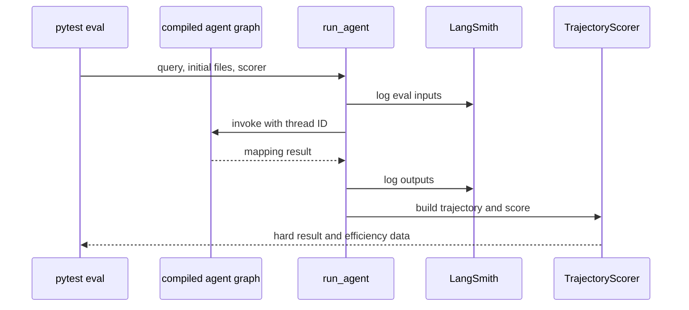
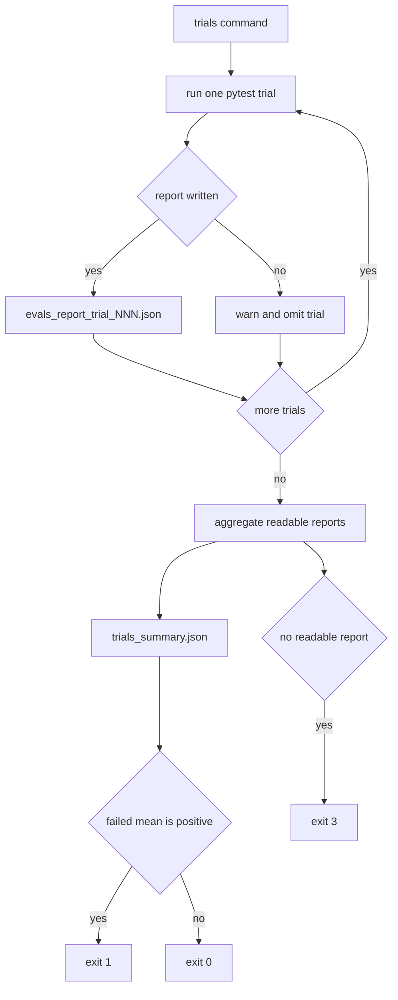

# Run and Extend Evaluations

`libs/evals` is the Deep Agents SDK's end-to-end behavioral evaluation suite. A pytest eval runs an agent against a real LLM, captures its trajectory—tool calls, file mutations, and final response—and scores correctness and efficiency. This is deliberately different from deterministic unit tests: use unit tests for harness and adapter mechanics, and the real-model suite to investigate observable agent behavior or model quality.

Related guidance: [development](../operations/development.md), [testing guide](../testing/testing-guide.md), and [build a Deep Agent](build-a-deep-agent.md).

## Choose the boundary and entry point

| Question | Entry point | What it produces |
| --- | --- | --- |
| Did local evaluation infrastructure change safely? | `make test` | Unit tests in `tests/unit_tests`, with non-Unix sockets disabled. |
| Does a model satisfy one controlled SDK behavior? | `deepagents-evals run` | One traced pytest rollout and an optional JSON report. |
| Is a behavioral result stable rather than a single stochastic observation? | `deepagents-evals trials` | Per-trial reports plus summary statistics. |
| Can an agent solve task-owned sandbox work? | `harbor run` or the Harbor Make targets | Harbor job artifacts, task verifier reward, and trajectory. |
| How do models compare on external agent capabilities? | `unified_evals.yml` | A cross-model leaderboard and, with enough axes, a radar chart. |

From `libs/evals`, `make test` is the offline-focused target; `make evals` is a real-model invocation and requires tracing and provider credentials.

```sh
cd libs/evals
uv sync --all-groups
make test TEST_FILE=tests/unit_tests/
make test TEST_FILE=tests/unit_tests/test_eval_catalog.py
```

## Run behavioral SDK evals

The canonical operator interface is the `deepagents-evals` console script (`deepagents_evals.cli:main`). It has `run`, `trials`, `aggregate`, `radar`, `catalog`, `model-groups`, and `list` subcommands. `--json` provides structured stdout and `--dry-run` previews execution for the subcommands that support them.

The pytest eval configuration requires a model and LangSmith tracing. Set a supported tracing variable to `true`, provide `LANGSMITH_API_KEY`, and export the provider credential for the selected model before launching a real run.

```sh
cd libs/evals
export LANGSMITH_TRACING=true
export LANGSMITH_API_KEY=...
export ANTHROPIC_API_KEY=...

# Discover without importing the real-model test modules.
deepagents-evals list categories
deepagents-evals list tiers
deepagents-evals list models --group set0
deepagents-evals list evals --category tool_use

# A narrow rollout with a machine-readable artifact.
deepagents-evals run --model anthropic:claude-opus-4-7 \
  --eval-category tool_use --eval-tier baseline --report evals_report.json
```

`list` reads categories from `deepagents_evals/categories.json`, exposes the fixed `baseline` and `hillclimb` tiers, lazily loads model entries from `.github/scripts/evals/models.py`, and finds evals with the catalog generator's AST walker. It does not import test modules merely to answer discovery questions.

`run` launches `uv run --group test pytest tests/evals` from `libs/evals`, forwarding model, category, tier, provider, reasoning, REPL, report, and extra pytest arguments. `--model` takes precedence over `DEEPAGENTS_EVALS_MODEL`; if neither is present it exits with configuration code `2` and displays known groups. Model specs and named groups are curated in `.github/scripts/evals/models.py`; `MODEL_GROUPS.md` is generated from it.

Category inclusion flags are repeatable; an `--eval-category-exclude` match wins. Collection rejects category or tier values that do not appear on collected tests. Pinning `--openrouter-provider` requires an `openrouter:` model, and fallback routing is opt-in. Likewise, `--openai-reasoning-effort` requires an `openai:` model.

The Make targets remain the compact CI-compatible interface and fail fast if required variables are absent:

```sh
make evals MODEL=anthropic:claude-opus-4-7
make evals-trials MODEL=openai:gpt-5.5 TRIALS=3 \
  TRIAL_ARGS="--eval-category memory"
```

## How an eval becomes a score

An eval is a `@pytest.mark.langsmith` test which takes the `model` fixture, normally builds `create_deep_agent(...)`, and calls `run_agent(...)` with a `TrajectoryScorer`. `run_agent` creates graph inputs from the query, optional initial files, and extra state; invokes the graph with a thread ID; logs minimal inputs and the result to LangSmith; converts a mapping result to `AgentTrajectory`; then applies the scorer.


```mermaid
sequenceDiagram
    participant Test as pytest eval
    participant Agent as compiled agent graph
    participant Runner as run_agent
    participant Trace as LangSmith
    participant Score as TrajectoryScorer
    Test->>Runner: query, initial files, scorer
    Runner->>Trace: log eval inputs
    Runner->>Agent: invoke with thread ID
    Agent-->>Runner: mapping result
    Runner->>Trace: log outputs
    Runner->>Score: build trajectory and score
    Score-->>Test: hard result and efficiency data
```

Caption: `run_agent` owns the invocation-to-trajectory boundary while the pytest/LangSmith layer records the run.

The scorer has two assertion tiers, which must remain semantically distinct:

- `TrajectoryScorer.success(...)` is a correctness assertion and fails the test when false.
- `TrajectoryScorer.expect(...)` records trajectory-shape efficiency expectations, such as steps or tool-call counts, but never fails the test.

Use `success` only for required behavior; use `expect` for diagnostic efficiency signals so legitimate alternate solution paths remain valid. The reporter computes correctness, step and tool-call ratios, solve rate, duration, category scores, failure details, and LangSmith experiment links. Inspect the trace and failure message before treating a score as a root cause.

### Add or change an eval

1. Add focused deterministic coverage if changing framework, reporting, filtering, or adapters.
2. Mark a real-model test with `@pytest.mark.langsmith`; tag it with `eval_category` and an appropriate `eval_tier`.
3. Accept `model`, build the agent, invoke `run_agent`, and express must-pass versus efficiency behavior with `success` and `expect`.
4. If adding a category, add its name and label to `categories.json`, add it to `radar_categories` only when it is a capability axis rather than plumbing, and update category-tagging coverage.
5. Regenerate the catalog, run focused unit tests, then use multiple real-model trials before concluding that a stochastic change is an improvement.

`EVAL_CATALOG.md` is generated from AST-visible evals under `tests/evals/`, not hand-maintained. Regenerate it with `make eval-catalog`; the catalog drift test runs its generator with `--check`. Similarly, regenerate model documentation with `make model-groups`. `deepagents-evals catalog --check` and `model-groups --check` report generated-file drift as configuration exit code `2`, rather than as an eval regression.

## Repeat trials and interpret artifacts

Use trials for a same-model, same-configuration sweep. A local `run_trials` invocation is sequential because concurrent in-process LangSmith experiment creation and provider rate limits are unsafe; CI can distribute trials across jobs and merge downloaded reports using aggregate-only mode.

```sh
deepagents-evals trials --model openai:gpt-5.5 --trials 3 \
  --eval-category memory --out-dir trial_runs/memory

# Merge reports produced by separate jobs.
deepagents-evals aggregate trial_runs/memory --summary-out summary.json

# Retry each distinct prior failing node ID once.
deepagents-evals trials --model openai:gpt-5.5 --trials 1 \
  --retry-failed trial_runs/memory/trials_summary.json
```


```mermaid
flowchart TD
    Start["trials command"] --> Trial["run one pytest trial"]
    Trial --> Written{"report written"}
    Written -- yes --> Save["evals_report_trial_NNN.json"]
    Written -- no --> Warn["warn and omit trial"]
    Save --> More{"more trials"}
    Warn --> More
    More -- yes --> Trial
    More -- no --> Aggregate["aggregate readable reports"]
    Aggregate --> Summary["trials_summary.json"]
    Summary --> Failed{"failed mean is positive"}
    Failed -- yes --> One["exit 1"]
    Failed -- no --> Zero["exit 0"]
    Aggregate --> None{"no readable report"}
    None -- yes --> Three["exit 3"]
```

Caption: trials preserve usable reports, aggregate them after execution, and determine pass/fail from aggregate counts.

Each trial writes `evals_report_trial_NNN.json`, including metrics and a `failures` array. `trials_summary.json` reports mean, median, sample standard deviation, min, and max for correctness, solve rate, step and tool-call ratios, duration, pass/fail counts, and category scores. `null` values do not contribute to a metric's sample and nonnumeric values are warned about and excluded. Model or SDK version disagreement across reports is warned about: do not draw a regression conclusion from a mixed campaign.

The reporter rewrites pytest's session status to zero even after individual eval failures, so the CLI must not use a trial's `pytest_returncode` as the trial-sweep verdict. It uses aggregated `counts.failed.mean`: a positive value is exit `1`. `--retry-failed` accepts a summary file or report directory, reads and deduplicates `failures[].test_name` node IDs, and returns `3` when no retryable IDs are found, including when discovered reports cannot be parsed.

| Exit | Meaning for automation |
| --- | --- |
| `0` | Success, or an aggregate with no failed evals. |
| `1` | Eval failure, including positive aggregate failed mean. |
| `2` | Invalid CLI/configuration, model registry problem, argparse usage error, or generated-file drift under `--check`. |
| `3` | No usable reports, including unparseable prior reports for retry. |

## Harbor: external sandbox benchmarks

Harbor is a separate boundary from the pytest behavioral harness: it runs task-owned sandbox environments and their verifiers. `deepagents_harbor` owns the Deep Agents-side LangSmith dataset/experiment/feedback plumbing and Harbor failure classification. Its LangGraph project declares the packages installed in the sandbox environment and exposes `dcode`, `bare`, and `tau3` graphs.

Stage local source packages before a sandbox install. The Make targets stage checked-out Deep Agents, deepagents-code, ACP, and QuickJS under `.local_deps`, then invoke Harbor with the selected graph and sandbox backend.

```sh
cd libs/evals
make stage-harbor-local-deps
make run-hello-world MODEL=anthropic:claude-opus-4-7
make run-terminal-bench-docker MODEL=anthropic:claude-opus-4-7
```

Terminal Bench targets select Docker, Modal, Daytona, Runloop, or LangSmith environments. Their `-n` value is concurrent sandbox trials, not task count. The LangGraph agent temporarily removes provider and LangSmith credentials while constructing shell-backed agent operations, then restores them; task shell commands must not inherit those secrets.

Do not call an outcome a model regression before classifying it. `FailureCategory` separates `CAPABILITY` from `INFRA_OOM` (exit 137), `INFRA_TIMEOUT` (exit 124), `INFRA_SANDBOX`, and unknown outcomes. Its extractor searches structured trajectory observations for exit codes, avoiding model text that merely mentions an exit code. Retry or repair infrastructure failures rather than folding them into a capability score.

The DRBench dataset is generated rather than committed: `make dataset` populates `datasets/drbench-evals` from the pinned upstream configuration, while `make dataset-check` verifies pins and deterministic generation. This protects benchmark answer material from ordinary repository changes and makes dataset integrity an explicit maintenance operation.

## Unified cross-model evaluation

The dispatchable `.github/workflows/unified_evals.yml` runs comma-separated `provider:model` specifications against a fixed external battery, yielding a single cross-model leaderboard and a radar chart when at least three axes run. It defaults to `autonomous`, `conversation`, and `research`; `context` is available when selected.

| Axis | Benchmark | Runtime |
| --- | --- | --- |
| Autonomous | `harbor-index/harbor-index` | `bare` or `dcode` |
| Conversation | `tau3-subset` | `tau3` |
| Context | `context-retrieval-evals` | `bare` or `dcode` |
| Research | `drbench-evals` | `bare` or `dcode` |

`bare` is the neutral `create_deep_agent` graph and `dcode` is the product agent. Conversation is necessarily `tau3`: its runtime hosts the MCP user simulator required for the multi-turn protocol, unlike the single-shot bare/dcode graphs. For pass/fail axes, pass@K is the fraction of tasks that pass in at least one of K rollouts. avg@K is passing trials over all expected trials, so missing rollouts count as failures. Graded research has pass@K of zero by construction and is reported with avg@K instead.

```sh
gh workflow run unified_evals.yml \
  -f models="anthropic:claude-opus-4-7,openai:gpt-5.5" \
  -f categories="autonomous,conversation,research" \
  -f agent_impls="bare" \
  -f rollouts="3"
```

Keep the model set, tasks/profile, rollouts, harness, sandbox, and judge constant for comparison. In particular, a judge change requires a new research baseline. Research runs in a special Docker/arm configuration with constrained concurrency because its application-stack images are arm64 and disk intensive; it alone receives `TAVILY_API_KEY` to enable open-web research. Never put credentials in `harbor_package_override`.

## Focused verification checklist

- Run `make test TEST_FILE=tests/unit_tests/test_eval_catalog.py` after changing eval discovery or catalog generation.
- Run `deepagents-evals catalog --check` and `deepagents-evals model-groups --check` in CI or before a metadata-only change.
- Run relevant `tests/unit_tests` for CLI, trial aggregation, reporter, Harbor adapter, or graph changes before a paid rollout.
- For a behavior change, execute a narrow category/tier rollout first, inspect its LangSmith trace and JSON report, then run repeated trials for any comparative claim.
- For Harbor/unified work, retain the exact run configuration and artifacts, separate infrastructure outcomes from capability outcomes, and compare only like-for-like campaigns.
