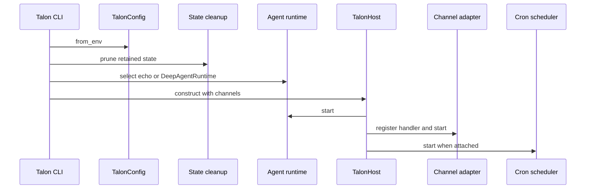
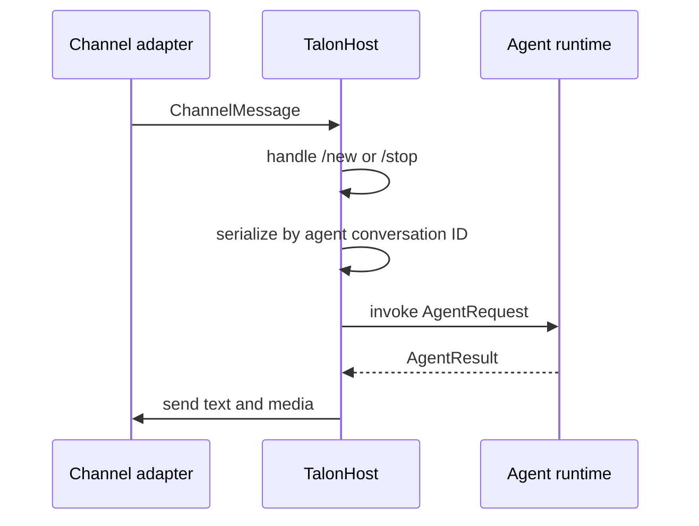
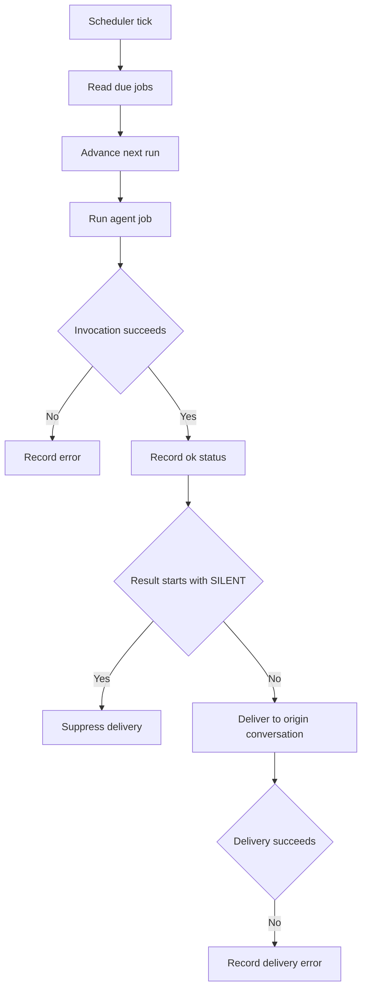

# Deep Agents Talon local runtime host

`libs/talon` packages `deepagents-talon`, an alpha local host for a long-running Deep Agent. Its installed command is `deepagents_talon.__main__:main`; version `0.0.4` requires Python 3.12 or newer. Talon owns one process event loop for channel adapters, cron scheduling, and agent invocation. It composes the core SDK described in [Runtime and package architecture](../architecture/overview.md), rather than defining another agent runtime, and reuses the `fetch_url`, `web_search`, and MCP-login surfaces of [Deep Agents Code](deep-agents-code.md).

## Scope and safety boundary

Consult this page for Talon host, channel, cron, Fleet-import, or assistant-local state changes. It is explicitly experimental and not intended for production or enterprise deployment. It does **not** provide multi-tenant isolation, sandbox-backed execution isolation, complete production HITL policy, or channel-administrator controls. Treat an enabled channel as direct access to the operator's agent, model credentials, MCP tools, and local host resources; approval prompts are a convenience flow, not containment.

The primary package documentation is `libs/talon/README.md`. It describes operator configuration without placing credentials in repository files. The normal package-local smoke boot uses the echo runtime when no model is configured:

```bash
cd libs/talon
uv sync --group test
AGENT_ASSISTANT_ID=local uv run deepagents-talon --once
```

## Bootstrap and component ownership

`__main__.py::main()` reads `TalonConfig`, creates the assistant-scoped `CronJobStore`, calls `cleanup_sensitive_state()`, selects enabled WhatsApp and Telegram adapters, and creates `TalonHost`. It selects `EchoAgentRuntime` when no model is configured; otherwise `_agent_runtime()` loads async subagents and MCP tools, then constructs `DeepAgentRuntime`. A scheduler is attached only when there is at least one channel, so a successful `--once` boot is a host wiring check rather than a channel or model integration test.



This sequence is the startup ordering: cleanup precedes construction, the runtime starts before channels accept messages, and the scheduler starts after channels.

### Configuration and local state

`config.py::TalonConfig.from_env()` selects `DEEPAGENTS_TALON_ASSISTANT_ID`, then `AGENT_ASSISTANT_ID`, defaulting to `default`; IDs are restricted to one safe path segment. The assistant home is `DEEPAGENTS_TALON_HOME/<assistant_id>` or `~/.deepagents/<assistant_id>`. `ensure_home()` creates the home plus manifest, subagent, cron, channel, and inbound-media directories with mode `0700`.

`data_lifecycle.py::cleanup_sensitive_state()` runs at process boot. It prunes completed cron records after `DEEPAGENTS_TALON_CRON_RETENTION_DAYS` (30 by default) and inbound media after `DEEPAGENTS_TALON_INBOUND_MEDIA_RETENTION_HOURS` (24 by default). It does not make conversation state durable: `DeepAgentRuntime` defaults to an in-memory LangGraph checkpointer. Do not describe channel credential state, cron prompts, media, or manifest instructions as non-sensitive; the package README defines their retention and external data flows.

For changes to this lifecycle, preserve validation of non-negative retention values and the boot-before-host ordering. `tests/test_data_lifecycle.py::test_cleanup_sensitive_state_prunes_cron_and_inbound_media` verifies both expiry boundaries:

```bash
cd libs/talon && make test TEST_FILE=tests/test_data_lifecycle.py
```

## Channel turn lifecycle and extension seam

A channel implements `interfaces.py::ChannelAdapter`: lifecycle methods, message delivery, text/media sending, and status. A reaction-capable adapter additionally implements `ReactionChannelAdapter`. `TalonHost.start()` installs handlers before starting each channel; `stop()` first cancels active work, then stops channels in reverse order, stops the scheduler, and finally stops the runtime.



This is the ordinary channel turn; voice transcription and media preparation occur in the host before invocation when configured.

`host.py::receive_message()` namespaces a channel conversation by provider and routes `/new` and `/stop` before creating a turn task. `_invoke_agent()` holds one `asyncio.Lock` per agent conversation ID, so messages in the same conversation cannot overlap while independent conversations can progress separately. `/stop` cancels in-flight conversation tasks; `/new` also cancels work, increments a reset counter, and makes subsequent requests use a new `:talon-reset:` thread ID. Keep that reset behavior aligned with the runtime checkpointer: it is the observable history boundary.

A tool interrupt is represented by `ToolApprovalRequest`. Channel-originated runs pass an approval handler; scheduled runs do not, and the runtime auto-denies gated tools in that context. `DEEPAGENTS_TALON_INTERRUPT_ON_TOOLS` adds tool names to agent-provided interrupt configuration. Do not treat a channel reaction or text decision as a substitute for an authorization boundary.

When adding a channel, implement the protocol and configuration, wire it in `__main__.py::_channels()`, and test provider identity, inbound filtering, offset/session persistence where applicable, and message/reaction callbacks. `tests/test_host.py` contains the narrow behavior suites: `test_host_serializes_messages_per_conversation`, `test_stop_cancels_in_flight_conversation`, and `test_new_command_starts_fresh_conversation_thread`.

```bash
cd libs/talon && make test TEST_FILE=tests/test_host.py
```

Run `tests/channels/test_telegram.py` or the corresponding adapter suite when changing transport, exposure, offsets, media, or reactions; a host-only test is not sufficient for a provider boundary.

## SDK graph construction and tool surface

`runtime.py::DeepAgentRuntime.start()` is Talon's SDK assembly seam. It defaults to `LocalShellBackend`, creates an `InMemorySaver`, resolves `AGENTS.md`, skills, and memory below the assistant directory, adds web and cron tools, applies optional summarization middleware, then calls `create_deep_agent()`. The compiled graph receives the agent conversation ID as LangGraph `thread_id`; this is why host conversation serialization and `/new` thread rotation must be preserved.

Talon supplies runtime MCP tools loaded from the configured MCP file, plus its own cron management tools when a store is available. It also imports the coding-agent web tools from `deepagents_code.tools`. Changing either reused interface should be assessed with [Deep Agents Code](deep-agents-code.md) as well as the Talon runtime test: this consumer boundary can break even when the defining package passes independently.

The runtime retries selected transient provider, parse, context-limit, and transport errors up to `DEFAULT_MAX_RETRIES` (3); cancellation is re-raised. If an invocation returns no text, it issues bounded continuation nudges and then a forced-summary prompt. Preserve the positive recursion-limit constraint and the `DEEPAGENTS_TALON_RECURSION_LIMIT` override when changing invocation policy.

For graph assembly, tool selection, checkpointer/thread behavior, interrupt handling, or retry policy, start with `tests/test_runtime.py::test_runtime_wires_backend_checkpointer_tools_skills_and_memory` and the neighboring named suites:

```bash
cd libs/talon && make test TEST_FILE=tests/test_runtime.py
```

Broaden to core SDK tests only when the change modifies a `create_deep_agent()` contract, backend behavior, middleware behavior, or a public SDK export. A Talon-local test proves composition; it does not prove a shipped SDK API still resolves for external consumers.

## Persistent cron jobs

`cron/jobs.py::CronJobStore` persists assistant-scoped records in `cron/jobs.json`; a `CronJob` retains its prompt, origin conversation, schedule, repeat state, next/last run, and last status/error. Schedules are minute-granularity and accept `in <duration>` or `every <duration>` forms. The scheduler's persistent record and its channel delivery are related but separate: a job can execute successfully while its delivery fails.



This flow reflects `PersistentCronScheduler._run_due_job()`: it advances the job before invocation, writes execution status, and treats delivery as a second failure boundary. Preserve the claim-before-run ordering to prevent duplicate due execution. `tests/cron/test_scheduler.py` covers successful delivery, silent-result suppression, invocation errors, delivery errors, and structured lifecycle events.

```bash
cd libs/talon && make test TEST_FILE=tests/cron/test_scheduler.py
```

## Validation and escalation

Use the focused commands above for ordinary changes; they run socket-restricted tests via the package Makefile. For all Talon source changes, the normal package checks are conditional broader validation:

```bash
cd libs/talon
make test
make lint
```

Run live Telegram/WhatsApp, real model, MCP OAuth, tracing, or media-transcription checks only when the edit crosses that integration boundary; they require external accounts, credentials, services, hardware, or dependencies and are not routine unit checks. The package's WhatsApp bridge is a bundled Node artifact (`channels/whatsapp_bridge/bridge.js` and `package.json` in the wheel configuration); inspect that directory and the relevant channel test before changing bridge-facing behavior rather than hand-editing a derived package output.
